```{r setup, include=FALSE}
options(htmltools.dir.version = FALSE)
knitr::opts_chunk$set(collapse = TRUE,
                      fig.retina = 3)

library(ymlthis)
library(tidyverse)
```

class: title-slide, center, bottom

# `r rmarkdown::metadata$title`

## `r rmarkdown::metadata$subtitle`

### `r rmarkdown::metadata$author` &#183; Desirée De Leon


---
name: clouds
class: center, middle
background-image: url(images/Clouds.jpg)
background-size: cover

---
template: clouds

## .big-text[Hello.]

---
name: clouds2
class: middle, center
background-image: url(images/Clouds2.jpg)
background-size: contain

---
template: clouds2 

.pull-left[
### Alison Hill 


[<i class="fab fa-github"></i> @apreshill](https://github.com/apreshill)  
[<i class="fab fa-twitter"></i> @apreshill](https://twitter.com/apreshill)

]

--

.pull-right[
### Desirée De Leon  


[<i class="fab fa-github"></i> @dcossyleon](https://github.com/dcossyleon)  
[<i class="fab fa-twitter"></i> @dcossyle](https://twitter.com/dcossyle)

]

???

I'm Alison Hill. I'm a data scientist and professional educator at RStudio.

And I'm Desirée De Leon. I interned with Alison last summer at RStudio on the education team.

---
template: clouds2

.pull-left[
### Alison Hill 


[<i class="fab fa-github"></i> @apreshill](https://github.com/apreshill)  
[<i class="fab fa-twitter"></i> @apreshill](https://twitter.com/apreshill)

]

.pull-right[
### Desirée De Leon  


[<i class="fab fa-github"></i> @dcossyleon](https://github.com/dcossyleon)  
[<i class="fab fa-twitter"></i> @dcossyle](https://twitter.com/dcossyle)

]

???

And even though we don't have a video feed in this webinar, we promise we are real live humans who are stuck at home right now just like you all, sitting in front our computers.

---
class: freight-slide, center, middle, inverse

# .shadow-text[We ship a lot of websites.]

???

Alison is a developmental psychologist

Desirée is a neuroscientist

Neither of us is a web developer

But we both ship a lot of websites for teaching data science.

Here are just a few of them.


---
class: freight-slide, center, middle, inverse

# .shadow-text[We ship a lot of websites.]

http://bit.ly/giraffe-stats

https://education.rstudio.com/

https://bookdown.org/yihui/blogdown/

https://stat545.com/

https://conf20-intro-ml.netlify.com/

https://summer-of-blogdown.netlify.com/

https://apreshill.github.io/data-vis-labs-2018/


???

If you type the short link on the bottom right of this slide into your browser right now, you'll be able to follow along.

All of these links are clickable from the slides.

---
template: clouds

# Who are you?

???

So that's us. 

We are happy to be with you today, and we hope that in our time together we'll be able to help you do your job better.


---
class: middle, center

<div class="flex" style="margin: 0 1em;">
  <div class="column">
    <h3> You're an educator <h3>
    
  </div>
  
--

   <div class="column"style="margin: 0 1em;">
    <h3> You've got lots of .Rmds </h3>
    
  </div>
  

???

Here's who we think you are...

* You're an educator

* You have R Markdown files for teaching...

* But they're stuck on your computer, and you need to share them easily others. 

* And--- you probably have a new classroom space that looks like this-- so sharing needs to be done 100% online


---
class: middle, center


<div class="flex" style="margin: 0 1em;">
  <div class="column">
    <h3> You're an educator </h3>
    
  </div>
  
  <div class="column"style="margin: 0 1em;">
    <h3> You've got lots of .Rmds </h3>
    
  </div>
  
--
  <div class="column" style="margin: 0 1em;">
    <h3> Your new classroom </h3>
    
  </div>
</div>

???

Here's who we think you are...

* You're an educator

* You have R Markdown files for teaching...

* But they're stuck on your computer, and you need to share them easily others. 

* And--- you probably have a new classroom space that looks like this-- so sharing needs to be done 100% online

---
class: center
background-image: url("images/rawpixel/lesson-time.jpg")
background-size: contain
background-color: #f6f6f6

## You might feel like this right now.

???

And you might feel like this right now.

---
class: middle, center

# Sharing on **short notice**

???

With that in mind, we hope to give you a quick tour today of how to get your **course materials** [CLICK] online [CLICK] in the *fastest* way possible.

---
class: middle, center
background-image: url("images/short1.jpg")
background-size: cover

# Sharing on **short notice**

???

With that in mind, we hope to give you a quick tour today of how to get your **course materials** [CLICK] online [CLICK] in the *fastest* way possible.

---
class: middle, center
background-image: url("images/short2.jpg")
background-size: cover

# Sharing on **short notice**

???

With that in mind, we hope to give you a quick tour today of how to get your **course materials** [CLICK] online [CLICK] in the *fastest* way possible.

---
class: middle, center
background-image: url("images/short3.jpg")
background-size: cover

# Sharing on **short notice**

???


---
class: middle, center
background-image: url("images/rawpixel/inflation.jpg")
background-size: contain
background-color: #EBEAE6

???

So we'll show you how to build websites using R Markdown and friends. 

Our goal is to help you get your site up in the air...

---
class: inverse, center
background-image: url("images/rawpixel/blue-balloon.jpg")
background-size: cover

# This

???

with a link so that you can get on with your teaching...

---
class: top center
background-image: url("images/rawpixel/balloon-ouch.jpg")
background-position: bottom center
background-size: 40%

# Not this

???

and hopefully avoid HTML pain.

---

## Why make a course website?

--

```{r why-site, echo=FALSE}
knitr::include_graphics("images/rawpixel/fortress.jpg")
```

???

+ Shareable

+ Reproducible

+ Resilient

Why make a course website at all?  It makes your content shareable, reproducible, and resilient [to short-notice changes]

Saving here for now:
The good news is that R markdown is made for sharing

R Markdown can be knitted into websites

and websites can be shared easily with a single link

BUT BEFORE WE TALK ABOUT FULL COURSE WEBSITES, FIRST WE NEED TO TALK ABOUT A SINGLE RMD FILE....SO I'LL PASS IT OFF TO DESIREE TO LEAD US THROUGH THAT.


---
template: clouds

# What does an R Markdown Project look like?

???

Getting started, it's always a good idea to use an R Project, which is this 
---
ALL BLUE FOLDERS....
RPOJECT. MOMA
INDEX.RMD

???
LET'S OPEN A FOLDER [SS] AND TAKE A LOOK INSTIDE AND GO INSIDE THE RPOJECT IN RSTUDIO [SS RAW FILE]

REMOVE EXTRA 

---
template: clouds

# What does an R Markdown file look like?


---
class: middle, center
background-image: url()
background-size: contain

SCREENSHOT OF DIRECTORY. ONE FOLDER --> 

screenshot. GET RID OF CONSOLE COMPLETELY. 
HAVE IT ALREADY BE NAMED INDEX.
FONT SIZE LARGER


???

TRANSITION TO DESIREE

Let's start with a single Rmd file, inside an folder that is also an R project


---
class: middle, center

## An .Rmd

```{r single-rmd, echo=FALSE, out.width = "70%"}
knitr::include_graphics("images/screenshots/Single-rmd.jpg")
```

???

Here's what an RMD looks like....

---
class: middle, center

## An .Rmd


```{r single-rmd1, echo=FALSE, out.width = "70%"}
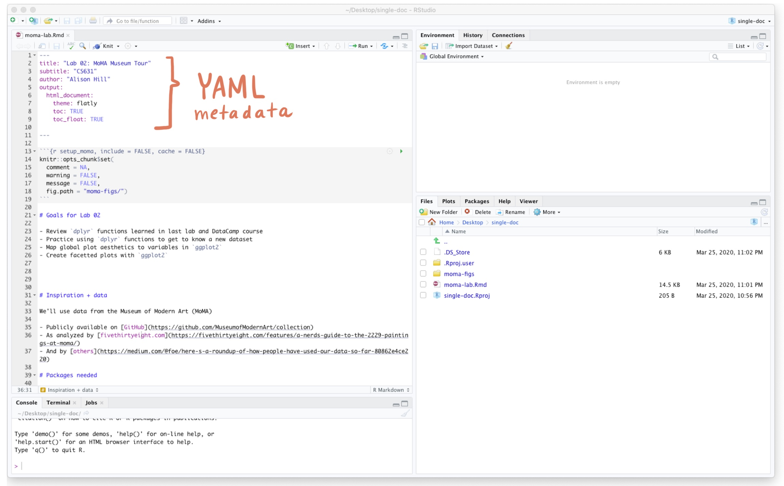
```


???

And it's made up of some metadata, which we call the YAML...

---
class: middle, center 

## An .Rmd

```{r single-rmd2, echo=FALSE, out.width = "70%"}
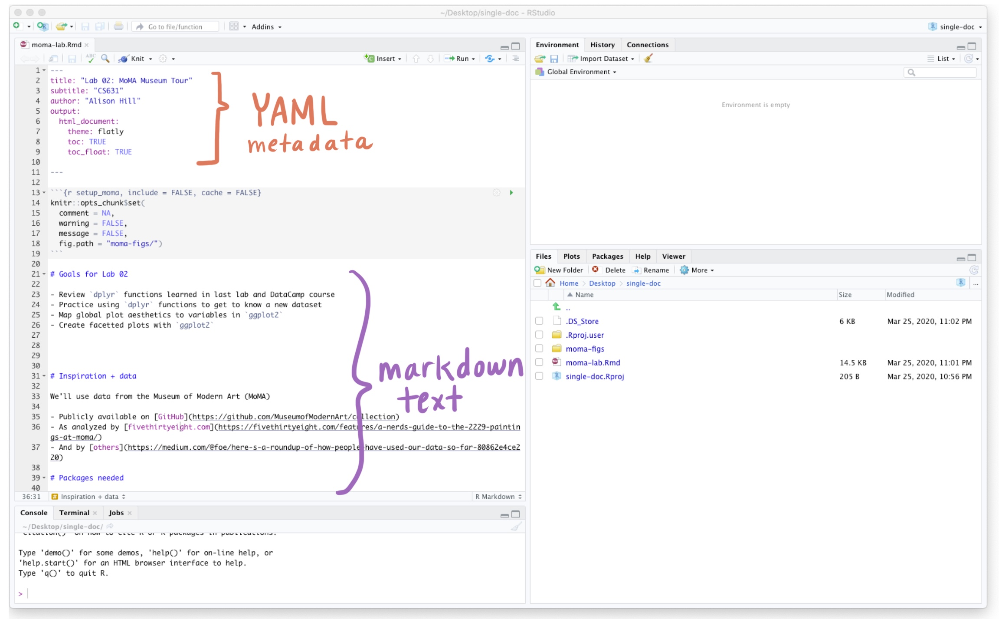
```

???

Text in the form of markdown

---
class: center middle

## An .Rmd

```{r single-rmd3, echo=FALSE, out.width = "70%"}
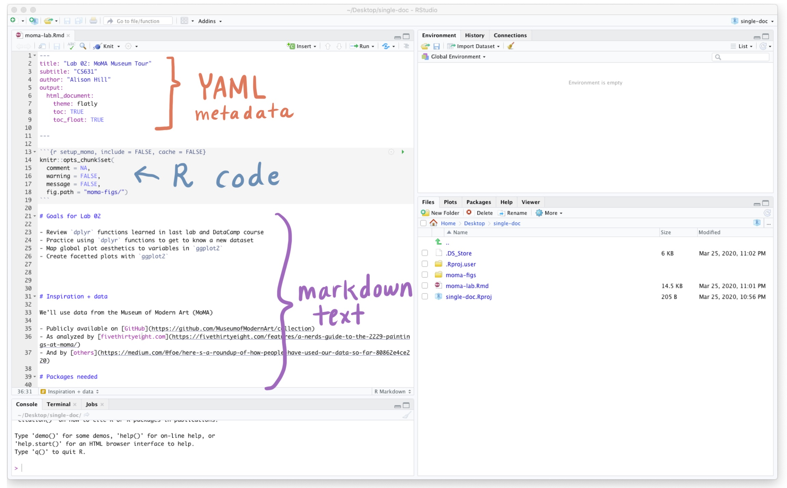
```

???

and oftentimes, code. 

---
template: clouds

# What does a .emphasis[shareable] .Rmd look like?

---
class: middle center

## A .emphasis[shareable] .Rmd

```{r single-rmd-knit, echo=FALSE, out.width = "70%"}
knitr::include_graphics("https://dcossyleon.github.io/gifs/video/single-doc-knit.gif")
```

???

Let's knit our RMD source file and see. 
We click Knit and...we get an HTML file.

---
class: middle center

## A .emphasis[shareable] .Rmd

```{r single-knit1, echo=FALSE, out.width = "70%"}
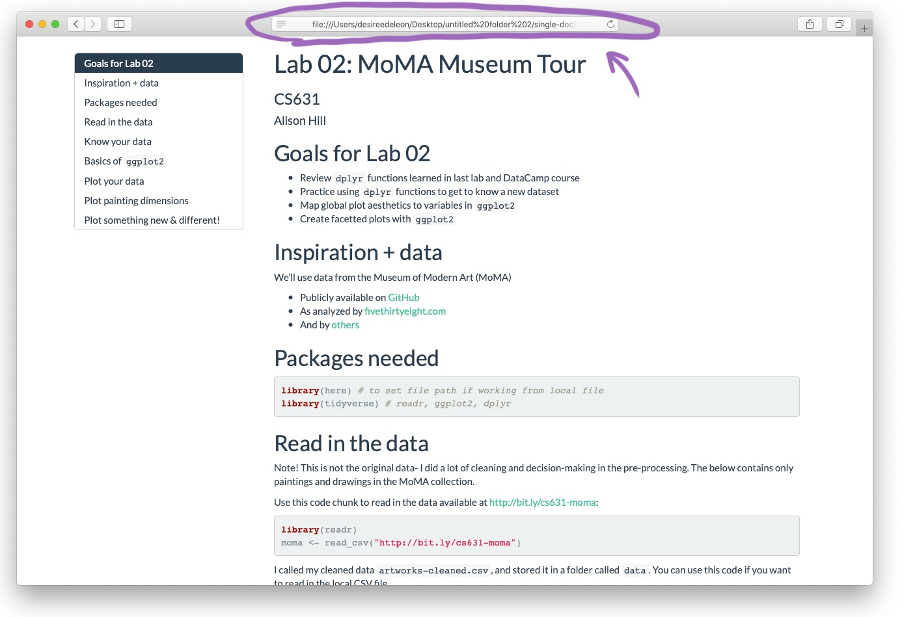
```

???
Voila! We have an HTML file that looks like a webpage. 
but this is still trapped on your computer--it's not yet online. 

---
class: middle center

## A .emphasis[shareable] .Rmd

```{r single-knit2, echo=FALSE, out.width = "70%"}
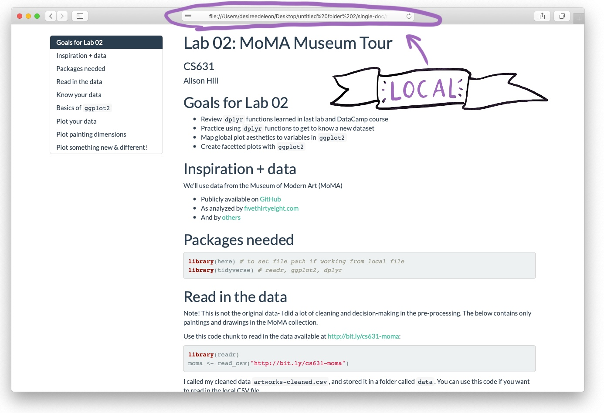
```

???

There is no *link* to give learners so they can access this content.
This is just the local filepath to the HTML file.


---
class: center middle

## What does a .emphasis[linkable] Rmd look like?

--

```{r hello-index, echo=FALSE}
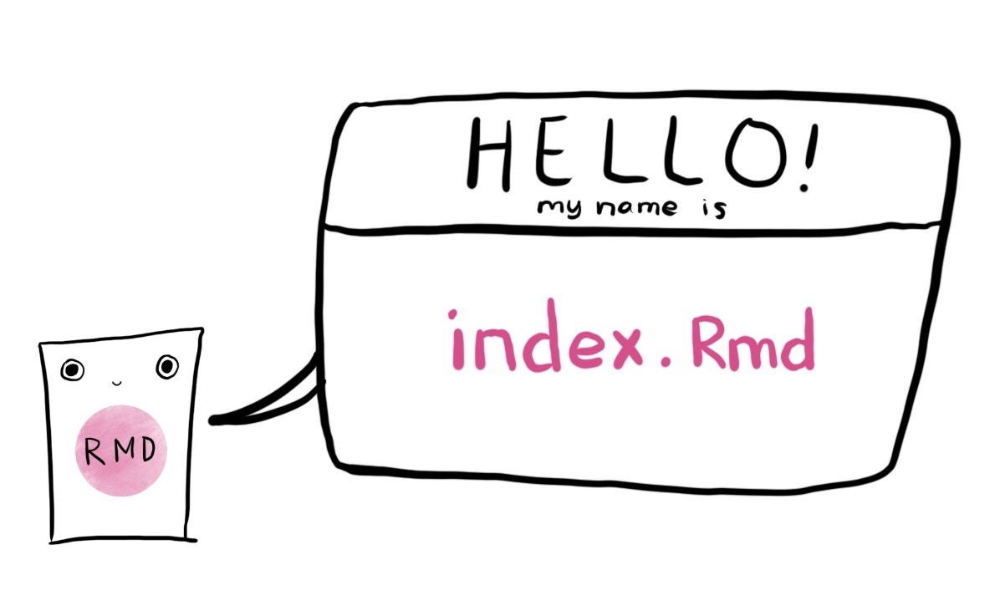
```

???

So thenk what does a *linkable* RMD look like? 
First, you have to make sure your RMD is named index.Rmd -- an internet browser will always begin by looking for a file named index because that's what it uses as a homepage. 


---
background-image: url("images/Server.jpg")
background-size: 80%
background-position: bottom
class: center, top

## What does a .emphasis[linkable] Rmd look like?

???

Second, we need a big computer in the clouds, otherwise known as a web server..

(h/t Heather Nolis: https://resources.rstudio.com/rstudio-conf-2020/we-re-hitting-r-a-million-times-a-day-so-we-made-a-talk-about-it-heather-nolis-dr-jacqueline-nolis)

---
class: top

## What does a .emphasis[linkable] Rmd look like?
.pull-left[
## Go here:
#### [app.netlify.com/drop](https://app.netlify.com/drop)
]

.pull-right[

]

???

For this webinar, we'll use servers provided by Netlify. 

---
class: center, middle

## What does a .emphasis[linkable] Rmd look like?

```{r single-dnd, echo=FALSE}
knitr::include_graphics("https://dcossyleon.github.io/gifs/video/single-doc-dnd.gif")
```

???

So we can go to app.netlify.com/drop -- and have the R Project folder with our RMD content ready to drop in. And netlify does the rest of the work for us. Giving us a link. And our site is there!

**Say "don't close out of this page"??**

---
class: middle center


???

Our R Markdown page is now alive on the internet. And this is the link where it lives. 
Has kind of a crazy name, but you can now send this to whomever you'd like.


---
class: center, middle
background-image: url(images/Clouds.jpg)
background-size: cover

# What just happened?

---
background-image: url(images/what-happened/single-doc/Slide1.jpeg)
class: middle center
background-size: contain


???

We started with an RMD file -->  we knit it to get our HTML version --> 
Then we dragged and dropped the folder with the HTML file straight into netlify to get our link.

---
background-image: url(images/what-happened/single-doc/Slide2.jpeg)
class: middle center
background-size: contain


???

---
background-image: url(images/what-happened/single-doc/Slide3.jpeg)
class: middle center
background-size: contain


???

---
background-image: url(images/what-happened/single-doc/Slide4.jpeg)
class: middle center
background-size: contain


???


---
background-image: url(images/what-happened/single-doc/Slide5.jpeg)
class: middle center
background-size: contain


???


---
background-image: url(images/what-happened/single-doc/Slide6.jpeg)
class: middle center
background-size: contain


???


---
class: middle, center

## Sharing = knit + drop -> LINK

???

Sharing your R Markdown means three things:

1. Have an index.Rmd

1. Knit to HTML

1. Transfer to web server

???


---
background-image: url(images/rawpixel/single-balloon.jpg)
background-size: contain
background-position: left
class: middle, center

.pull-right[
### But that is just one .Rmd file...
]


---
background-image: url(images/rawpixel/bunch-balloons.jpg)
background-size: contain
background-position: right
class: middle, center

.pull-left[
### We want to share many .Rmd files!
]


---
background-image: url(images/mtsalsa0.jpg)
background-position: bottom center
background-size: contain
class: top, center

## So where are we going?

???

"markdown mountain"

We've just shown you how to go from a regular RMD doc on your computer to one that's a web*page*.

---
background-image: url(images/mtsalsa.jpg)
background-position: bottom center
background-size: contain
class: top, center

## So where are we going?

???

Our goal for the rest of this webinar is to show you 4 RMD tools that are for turning a *COLLECTION* of RMDs into a web*site*.


---
name: default_site
class:  top, center
background-image: url(images/mtsalsa-rmd.jpg)
background-size: contain
background-position: center, bottom

???

So let's begin with an R Markdown site.

---
class: center middle
background-image: url(images/Clouds2.jpg)

<https://apreshill.github.io/data-vis-labs-2018>

<iframe src="https://apreshill.github.io/data-vis-labs-2018/index.html" height="600" width="1200" frameborder="0"></iframe> 

???

Here's what one looks like out in the wild. 

A website made up of many individual R Markdown documents.

Some of which are now connected via:

* A navbar

---
class: center middle
background-image: url(images/Clouds2.jpg)
background-size: cover

## R Markdown site

```{r, echo=FALSE}
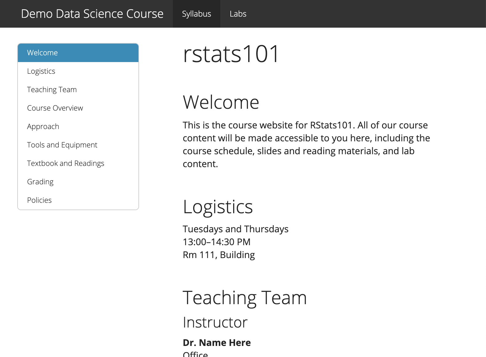
```

???

And here's a simple site that we're going to look at more closely.

---
background-image: url(images/Clouds2.jpg)
background-size: cover

## Inside the project

.left-column[
```{r eval=FALSE}
.
├── RMD-site.Rproj
├── _site.yml #<<
├── index.Rmd #<< 
├── Lab1.Rmd
```
]

.right-column[
```{r, echo=FALSE}

```
]

--

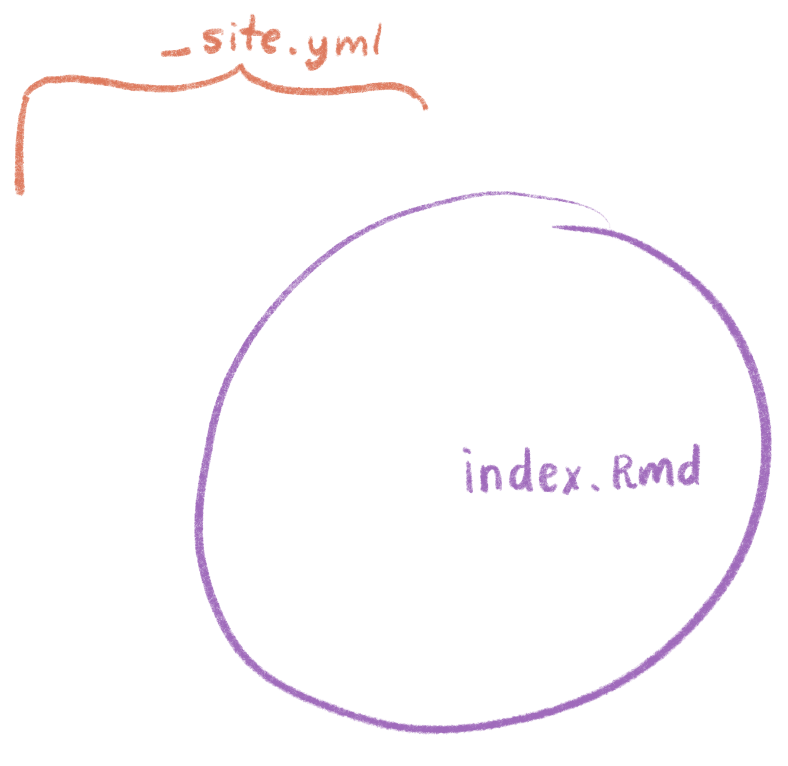

???

On the left, we have  directory tree, where you can see the files in the project directory. 

**Minimum** required files:

1. `index.Rmd` = Homepage

1. `_site.yml` = Navbar / theme 

---
background-image: url(images/Clouds2.jpg)
background-size: cover

## Inside the project

.left-column[
```{r eval=FALSE}
.
├── RMD-site.Rproj
├── _site.yml 
├── index.Rmd 
├── Lab1.Rmd #<< 
```
]

.right-column[
```{r, echo=FALSE}
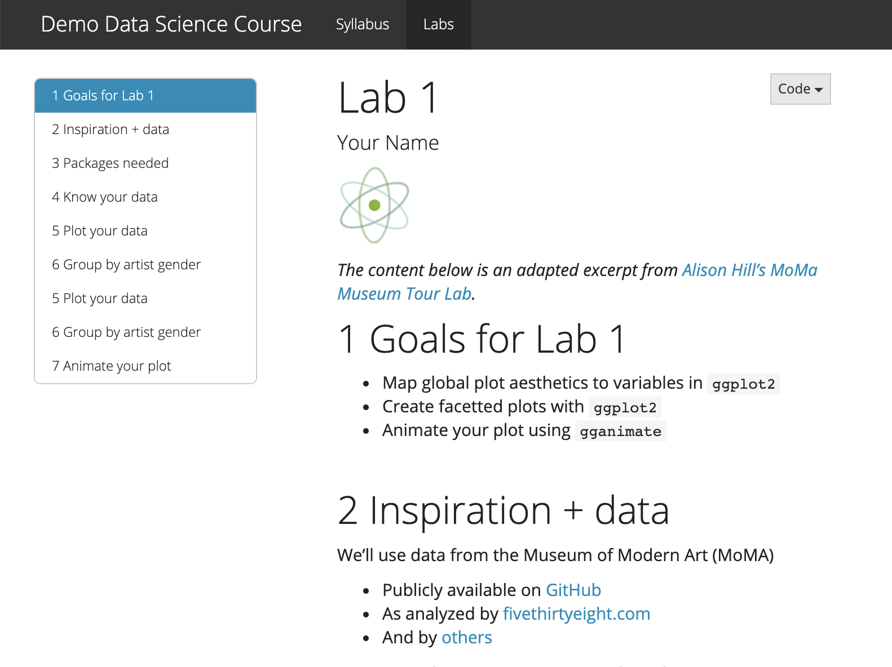
```
]

???

**Optional** but likely:

+ Other `.Rmd` files = Content 

---
name: rmd-site-yml
background-image: url(images/Clouds2.jpg)
background-size: cover

## Inside the `_site.yml`

.left-column[
```{r eval=FALSE}
.
├── RMD-site.Rproj
├── _site.yml #<<
├── index.Rmd
├── Lab1.Rmd
```
]

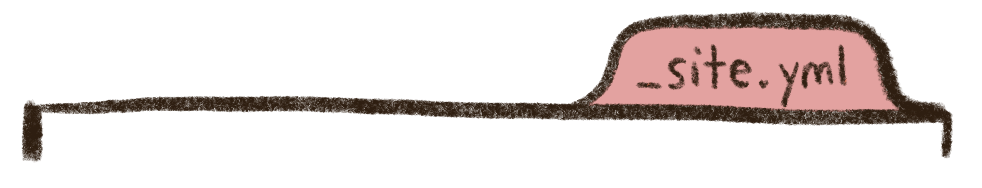


.right-column[
```{r echo=FALSE}
 yml_empty() %>%
  yml_navbar(
    title = "rstats101",
    left = list(
      navbar_page("Syllabus", href = "index.html"),
      navbar_page("Labs", href = "lab1.html")
    )) %>% 
  yml_output(html_document(toc = TRUE, toc_float = TRUE, theme = "yeti")) %>% 
  asis_yaml_output(fences = FALSE)
```
]

---
class: center, left

## Put it together and what have you got?

.pull-left[

.Rmds

```{r, echo=FALSE}
knitr::include_graphics("images/rawpixel/instruments.jpg")
```

]

--

.pull-right[

`_site.yml`

```{r, echo=FALSE}
knitr::include_graphics("images/orchestra.jpg")
```
]

---
name: build-rmd-site
background-image: url(images/Clouds2.jpg)
background-size: cover

## Build the site

.left-column[
```{r eval=FALSE}
.
├── RMD-site.Rproj
├── _site.yml
├── index.Rmd
├── Lab1.Rmd
└── _site/ #<<
```
]

.right-column[
```{r, echo=FALSE}
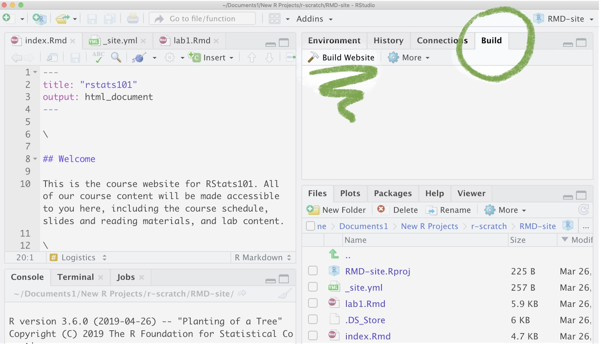
```
]


???

Once you have at minimum the _site.yml and the index.RMd
You can mouse over to the Build tab, which give you  HTML-website ready files in a folder called "_site"

---
class: middle, center

# How do you share this site?
Drag-and-drop `_site/`

---
class: center, middle

<video width="1530" height="610" controls>
    <source src="images/rmd-site-dnd.mp4" type="video/mp4">
</video>

???

And we will drop that folder back into netlify to make our site. 

---
class: center, middle

# But...

.pull-left[


]

.pull-right[
Only exists for 24 hours. 

Need to make a Netlify account to make it stick.
]

???

But if we do nothing else, this site will only exist for 24 hours. We need to make a Netlify account to make it stick. 

---
class: center, middle

# Back to Netlify

Make an account.

---
class: middle center

<video width="1510" height="638" controls>
    <source src="images/netlify-account.mp4" type="video/mp4">
</video>

???

So let's go back to Netlify and do that. 
Here's a gif of me doing this in one, two, three steps....

Now we can rest asssured that this link is here to stay, and we can share it with others. 

---
class: center, middle

# Update again?

---
class: center, middle

<video width="1560" height="620" controls>
    <source src="images/netlify-update.mp4" type="video/mp4">
</video>


---

class: middle, center
background-image: url(images/Clouds2.jpg)
background-size: cover


## Staying organized

<https://github.com/apreshill/data-vis-labs-2018>

```{r stay-organized, echo=FALSE}
knitr::include_graphics("https://dcossyleon.github.io/gifs/video/stay-organized1.gif")
```

---

class: middle, left

## R Markdown sites

.pull-left[

### Pros

* Source stays same

* Built-in themes (Bootstrap)

* Low dependencies

]

--

.pull-right[

### Cons

* No Rmds in folders

* Update navbar manually

* 1 content flavor

]

???

So in summary for RMD site, 
You don't have to change much from your original docs. 
You get to use built in themes from bootstrap
..
..
..

---
name: distill
class:  top, center
background-image: url(images/mtsalsa-distill.jpg)
background-size: contain
background-position: center, bottom

# `install.packages("distill")`

???

Next up is Distill, which you'll need to install first before you can use it. 

---
class: middle, center
background-image: url(images/Clouds.jpg)
background-size: cover

<https://blogs.rstudio.com/tensorflow/about.html>

<iframe src="https://blogs.rstudio.com/tensorflow/about.html/" height="600" width="1200" frameborder="0"></iframe> 


???

Here's a Distill site...and it's actually very similar to a RMD site, but it has some features built-in that make it especially good for technical and scientific content. ANd I'll show you an example of that in a second. 

Another great optional feature of Distill that is worth pointing out, is the ability to organize content into a blog format. 

---
class: center middle
background-image: url(images/Clouds.jpg)
background-size: cover

## Distill site

(Screenshot of basic Distill site)

???

And here's a simple Distill site that we're going to look at more closely.


---
background-image: url(images/Clouds.jpg)
background-size: cover

## Inside the project

.left-column[
```{r eval=FALSE}
.
├── distill-site.Rproj
├── _site.yml #<<
├── index.Rmd #<< 
├── listing.Rmd
├── _posts/
  ├── Class1/
    ├── Class1.Rmd
```
]

.right-column[
```{r, echo=FALSE}
#knitr::include_graphics("")
```

Basic distill Screenshot annotated
]

--


???

A Distill site without blog content needs the same minimum files as an RMD site. 

**Minimum** required files:

1. `index.Rmd` = Homepage

1. `_site.yml` = Navbar

But for the blog-like feature, you need a Blog Listing RMD, a folder, named posts/ which then contains a directory for each post you make. 

---

# Where is the site?

build with button

???

actually the same as Rmd site!

---

# How do you share this site?

Drag-and-drop `_site/`


???

actually the same as Rmd site!

---

.pull-left[

* Sleek

* 2 content flavors

* Nice features out-of-the-box

]

--

.pull-right[

* Knit posts one-by-one (but no manual adding to menus!)

* Project organization


]

---
name: bookdown
class:  top, center
background-image: url(images/mtsalsa-book.jpg)
background-size: contain
background-position: center, bottom


# `install.packages("bookdown")`


???


---
background-image: url("images/rawpixel/writing-machine.jpg")
background-size: contain
background-position: right
class: middle

# E-book with...

--

+ Table of contents

--

+ Chapters

--

+ Bells & whistles


---
class: middle, center

<https://bookdown.org/yihui/bookdown/>

<iframe src="https://bookdown.org/yihui/bookdown/" height="600" width="1200" frameborder="0"></iframe> 

???

Some new features to point out during "tour" :
* A very long TOC
* Chapters 
* Sections

---
# Inside the project

.left-column[

```{r eval=FALSE}
.
├── book.Rproj
├── _bookdown.yml
├── _output.yml
├── index.Rmd 
├── week01.Rmd
├── week02.Rmd
├── week03.Rmd
└── _book #<<
```
]

.right-column[
Build your book with the Build tab. 
]

---
# Sharing your book

.pull-left[

```{r eval=FALSE}
.
├── book.Rproj
├── _bookdown.yml
├── _output.yml
├── index.Rmd 
├── week01.Rmd
├── week02.Rmd
├── week03.Rmd
└── _book #<<
```
]

.pull-right[

_book/ --> drag and drop

```{r out.width = "50%"}
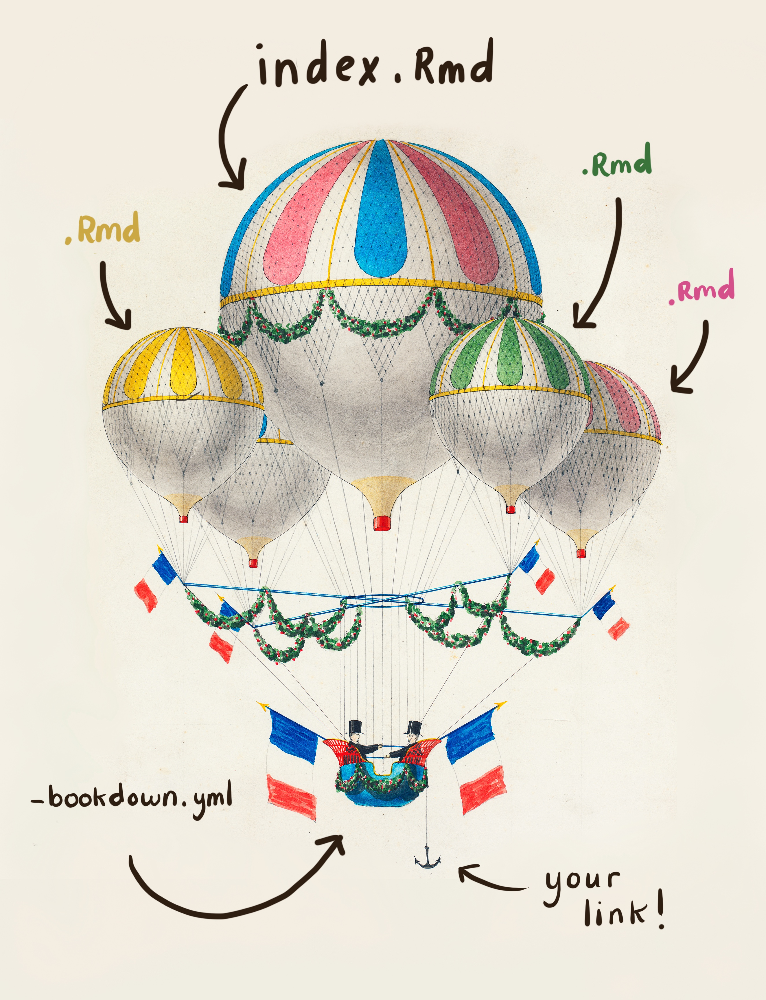
```

^ just in case you want to show this image before or after drag n drop

]

---

NOTE:
Move Book drag and drop to be the last thing.

---
# Inside the `index.Rmd`

.pull-left[

```{r eval=FALSE}
.
├── book.Rproj
├── _bookdown.yml
├── _output.yml
├── index.Rmd #<<
├── week01.Rmd
├── week02.Rmd
├── week03.Rmd
└── _book
```
]

.pull-right[
```{r book-index}
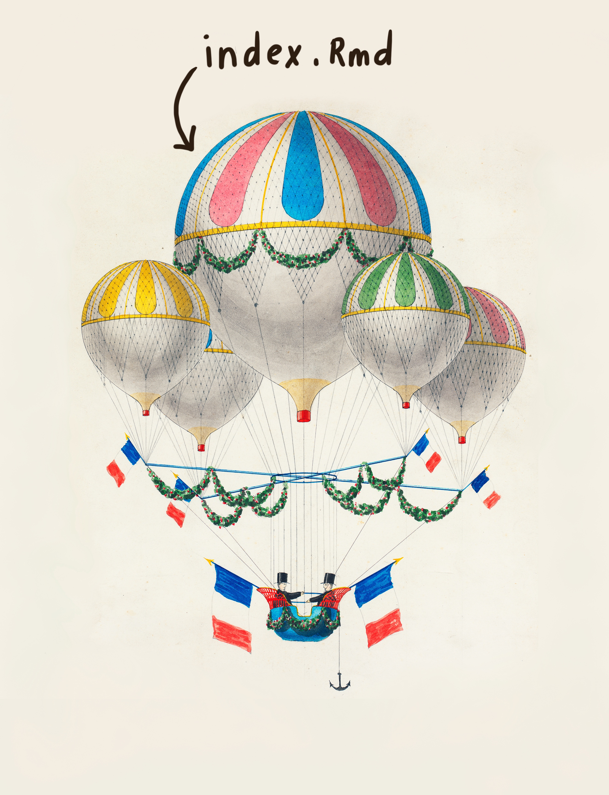
```
]

???

The index.Rmd file is special. It is both the first chapter, and contains some YAML for the book's metadata like the title. You can think of this as the mega-YAML for your book- it is the YAML for all the chapters.

---
## Inside the `index.Rmd`

.pull-left[

```{r eval=FALSE}
.
├── book.Rproj
├── _bookdown.yml
├── _output.yml
├── index.Rmd #<<
├── week01.Rmd
├── week02.Rmd
├── week03.Rmd
└── _book
```
]

.pull-right[


```
---
title: "A Book"
author: "Frida Gomam"
site: bookdown::bookdown_site
documentclass: book
output:
  bookdown::gitbook: default
---

Welcome to the course!
```

to-do convert to ymlthis
]


---
## Inside the chapters

.pull-left[

```{r eval=FALSE}
.
├── book.Rproj
├── _bookdown.yml
├── _output.yml
├── index.Rmd 
├── week01.Rmd #<<
├── week02.Rmd #<<
├── week03.Rmd #<<
└── _book
```
]

.pull-right[
```{r book-rmds}
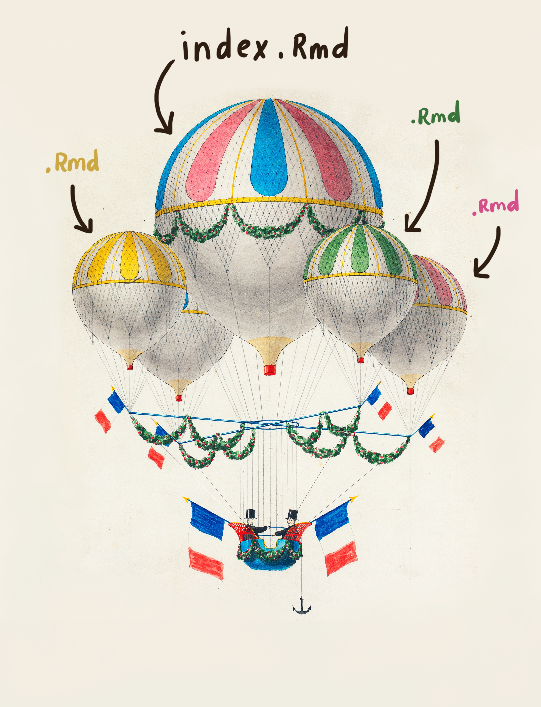
```
]

???

Every Rmd is a chapter

---
# Inside one chapter

.pull-left[

```{r eval=FALSE}
.
├── book.Rproj
├── _bookdown.yml
├── _output.yml
├── index.Rmd 
├── week01.Rmd #<<
├── week02.Rmd 
├── week03.Rmd 
└── _book
```
]

.pull-right[

```
# Week One

In our first week together, 
we'll cover the syllabus 
and how to use Zoom.

```

]

???

Main points- the Rmd chapters don't have any YAML. This will mean that you'll need to change any individual Rmd that you want to make into chapters.

---
# Inside the `.yml` files

.pull-left[
```{r eval=FALSE}
.
├── book.Rproj
├── _bookdown.yml #<<
├── _output.yml #<<
├── index.Rmd 
├── week01.Rmd 
├── week02.Rmd 
├── week03.Rmd 
└── _book 
```
]

.pull-right[

```{r book-ymls}
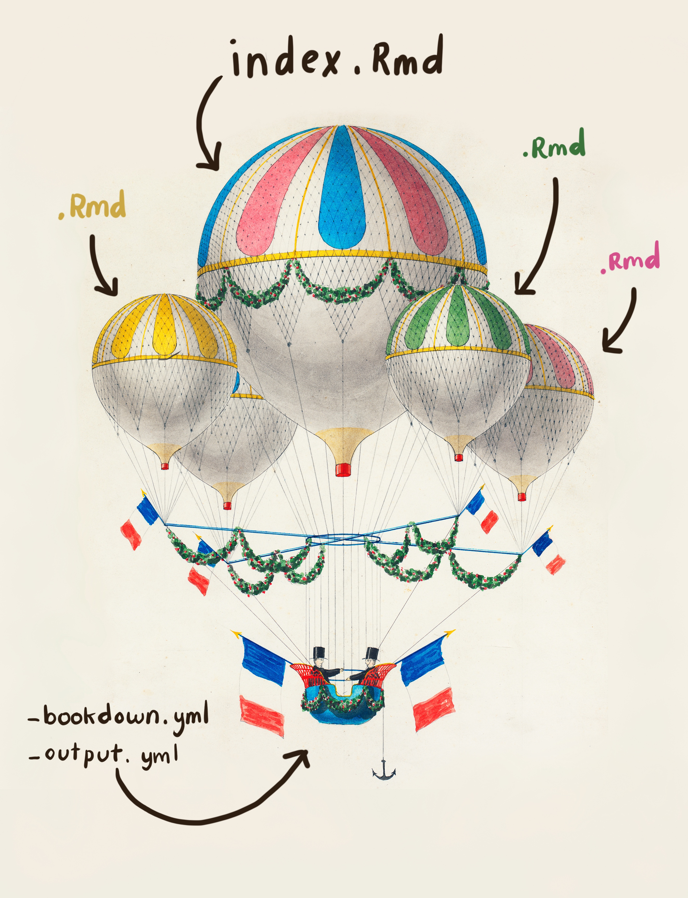
```

]


---


???

For example... a directory that looks like this.

Your RMDs will be in the root. The first one is still index.Rmd. This becomes the first page of your book. Usually an preface or Intro.

The REst of the RMDs are numbered. These each become book chapters. 

---
# Do I need to change the RMDs?

Yes. 

* You (might) need to rename all the files to have a numerical order. 
* All chapter .Rmd files MUST begin with a `# Level 1 Header` no matter what. No front matter YAMLS.

---

# ...here's why

(maybe if time allows)


---

# Pros and Cons of Bookdown

.pull-left[

* Long-form content friendly
* Clear ordering of content
* Cross-references
* Numbered figures, equations, tables

]

.pull-right[

* Three YAMLS (time consuming to set up)
* Project directory will have many RMDs and no good way to organize them into subdirectories
* Not easy to customize styling

]

---
class: inverse, center, middle

# blogdown

---

...is more intense, but here's what's possible.

???

Gif of blogdown

---

We won't go into the key files for this, but a main PRO of blogdown is that you get to have organized directories and subdirections. 

* Junk drawer vs Container Store

---

# Here's a shortcut you can use

Deploy to netlify link

???

Gif

---
class: inverse, center, middle

# Review

---

# the options


???

which options work best for whom?

---

# Other links, resources, stuff

---
background-image: url("images/rawpixel/site-dreams.jpg")
background-size: cover
class: top, center

# Thank you

---
name: excuses

## 3 excuses

.columns[

.left-col[
"I can't give away my work!"


] 


.middle-col[
"It's not perfect (yet)!" 

*"If it knits, it ships."*
]


.right-col[
"It's scary." 

*"If it hurts, do it more often."*
]

]
