```{r setup, include=FALSE}
options(htmltools.dir.version = FALSE)
knitr::opts_chunk$set(collapse = TRUE,
                      fig.retina = 3)

library(ymlthis)
library(tidyverse)
```

class: title-slide, center, bottom

# `r rmarkdown::metadata$title`

## `r rmarkdown::metadata$subtitle`

### `r rmarkdown::metadata$author` &#183; Desirée De Leon


---
layout: true
name: clouds
class: center, middle
background-image: url(images/Clouds.jpg)
background-size: cover

---
template: clouds

## .big-text[Hello.]

---
layout: true
name: clouds2
background-image: url(images/Clouds2.jpg)
background-size: contain

---
template: clouds2
class: middle, center

.pull-left[
### Alison Hill 


[<i class="fab fa-github"></i> @apreshill](https://github.com/apreshill)  
[<i class="fab fa-twitter"></i> @apreshill](https://twitter.com/apreshill)

]

--

.pull-right[
### Desirée De Leon  


[<i class="fab fa-github"></i> @dcossyleon](https://github.com/dcossyleon)  
[<i class="fab fa-twitter"></i> @dcossyle](https://twitter.com/dcossyle)

]

???

I'm Alison Hill. I'm a data scientist and professional educator at RStudio.

And I'm Desirée De Leon. I interned with Alison last summer at RStudio on the education team.

---
template: clouds2
class: middle, center

.pull-left[
### Alison Hill 


[<i class="fab fa-github"></i> @apreshill](https://github.com/apreshill)  
[<i class="fab fa-twitter"></i> @apreshill](https://twitter.com/apreshill)

]

.pull-right[
### Desirée De Leon  


[<i class="fab fa-github"></i> @dcossyleon](https://github.com/dcossyleon)  
[<i class="fab fa-twitter"></i> @dcossyle](https://twitter.com/dcossyle)

]

???

And even though we don't have a video feed in this webinar, we promise we are real live humans who are stuck at home right now just like you all, sitting in front our computers.

---
layout: false
class: freight-slide, center, middle, inverse

# .shadow-text[We ship a lot of websites.]

???

Alison is a developmental psychologist

Desirée is a neuroscientist

Neither of us is a web developer

But we both ship a lot of websites for teaching data science.

Here are just a few of them.


---
class: freight-slide, center, middle, inverse

# .shadow-text[We ship a lot of websites.]

http://bit.ly/giraffe-stats

https://education.rstudio.com/

https://bookdown.org/yihui/blogdown/

https://stat545.com/

https://conf20-intro-ml.netlify.com/

https://summer-of-blogdown.netlify.com/

https://apreshill.github.io/data-vis-labs-2018/


???

If you type the short link on the bottom right of this slide into your browser right now, you'll be able to follow along.

All of these links are clickable from the slides.

---
template: clouds

# Who are you?

???

So that's us. 

We are happy to be with you today, and we hope that in our time together we'll be able to help you do your job better.


---
class: middle, center

<div class="flex" style="margin: 0 1em;">
  <div class="column">
    <h3> You're an educator <h3>
    
  </div>
  
--

   <div class="column"style="margin: 0 1em;">
    <h3> You've got lots of .Rmds </h3>
    
  </div>
  

???

Here's who we think you are...

* You're an educator

* You have R Markdown files for teaching...

* But they're stuck on your computer, and you need to share them easily with others. 

* And--- you probably have a new classroom space that looks like this-- so sharing needs to be done 100% online

---
class: middle, center


<div class="flex" style="margin: 0 1em;">
  <div class="column">
    <h3> You're an educator </h3>
    
  </div>
  
  <div class="column"style="margin: 0 1em;">
    <h3> You've got lots of .Rmds </h3>
    
  </div>
  
--
  <div class="column" style="margin: 0 1em;">
    <h3> Your new classroom </h3>
    
  </div>
</div>

???

Here's who we think you are...

* You're an educator

* You have R Markdown files for teaching...

* But they're stuck on your computer, and you need to share them easily others. 

* And--- you probably have a new classroom space that looks like this-- so sharing needs to be done 100% online

---
class: center
background-image: url("images/rawpixel/lesson-time.jpg")
background-size: contain
background-color: #f6f6f6

## You might feel like this right now.

???

And you might feel like this right now.

---
class: middle, center

# Sharing on **short notice**

???

With that in mind, we hope to give you a quick tour today of how to get your **course materials** [CLICK] online [CLICK] in the *fastest* way possible.

---
class: middle, center
background-image: url("images/short1.jpg")
background-size: cover

# Sharing on **short notice**

???

With that in mind, we hope to give you a quick tour today of how to get your **course materials** [CLICK] online [CLICK] in the *fastest* way possible.

---
class: middle, center
background-image: url("images/short2.jpg")
background-size: cover

# Sharing on **short notice**

???

With that in mind, we hope to give you a quick tour today of how to get your **course materials** [CLICK] online [CLICK] in the *fastest* way possible.

---
class: middle, center
background-image: url("images/short3.jpg")
background-size: cover

# Sharing on **short notice**

???


---
class: middle, center
background-image: url("images/rawpixel/inflation.jpg")
background-size: contain
background-color: #EBEAE6

???

So we'll show you how to build websites using R Markdown and friends. 

Our goal is to help you get your site up in the air...

---
class: inverse, center
background-image: url("images/rawpixel/blue-balloon.jpg")
background-size: cover

# This

???

with a link so that you can get on with your teaching...

---
class: top center
background-image: url("images/rawpixel/balloon-ouch.jpg")
background-position: bottom center
background-size: 40%

# Not this

???

and hopefully avoid HTML pain.

---
class: center, middle

## Why make a course website?

--

```{r why-site, echo=FALSE}
knitr::include_graphics("images/rawpixel/fortress.jpg")
```

???

+ Shareable

+ Reproducible

+ Resilient

Why make a course website at all?  It makes your content shareable, reproducible, and resilient [to short-notice changes]

Saving here for now:
The good news is that R markdown is made for sharing

R Markdown can be knitted into websites

and websites can be shared easily with a single link

But before we talk about full course website, first we need to talk about single R Markdown files. So I'll pass it off to Desiree to get us started. 

---
template: clouds

# What does an .Rmd file look like?

???

Jumping right in, let's take a look at a single R Markdown file for a Lab lesson.

---
class: center, middle

```{r single-rmd, echo=FALSE}
knitr::include_graphics("images/screenshots/Rproj1.png")
```

???

Let's start by opening up the folder where the specific lab content lives.

---
class: center middle

```{r echo=FALSE}
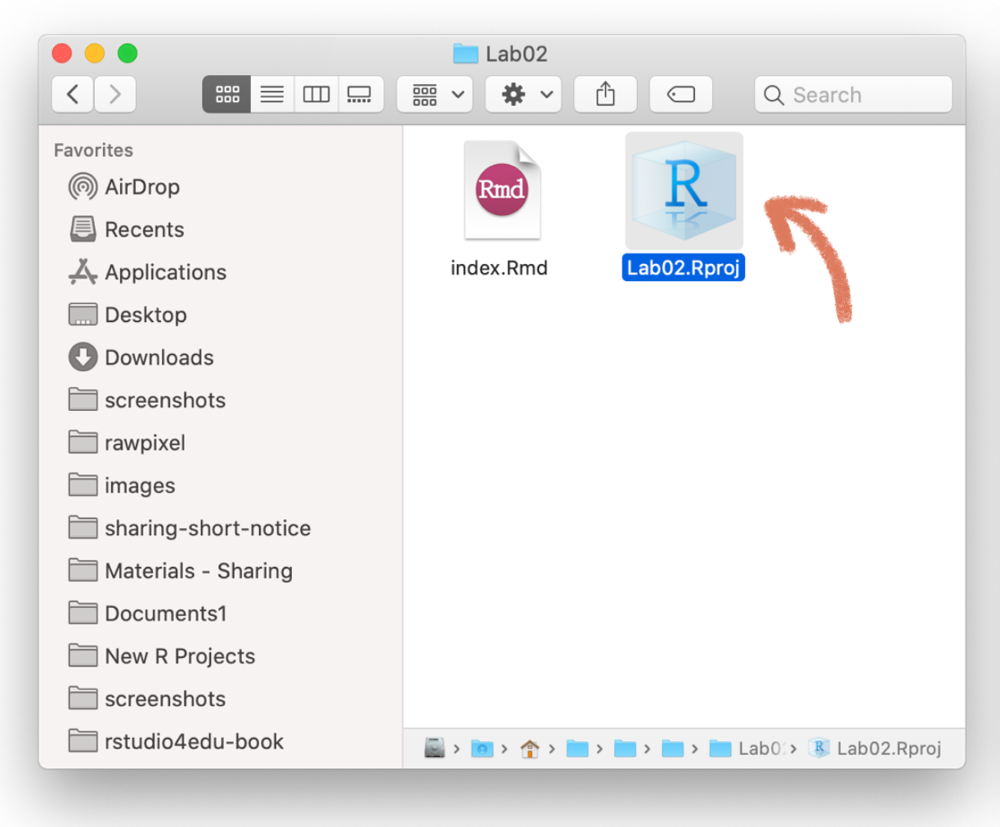
```


???
and inside of it, you'll notice that this folder is an **R Project** (which we strongly recommend you use).

We can click on the RProj file, which will port us into RStudio... 

---
background-image: url(images/screenshots/Single-rmd.png)
background-size: contain
class: middle, center

???

...where we can see our single R Markdown file for our lab. 

---
background-image: url(images/screenshots/Single-rmd0.png)
background-size: contain
class: middle, center

???

And it's made up of some metadata, which we call the YAML. The YAML has different "keys".

---
class: middle, center
background-image: url(images/screenshots/Single-rmd1.png)
background-size: contain

???

One of these Keys is the TITLE, and we say that it gets the *value* of `Lab 02: MoMA Museum Tour`.

---
class: middle, center
background-image: url(images/screenshots/Single-rmd2.png)
background-size: contain

???

Our YAML also has a section all about output. Here's where we specify what format we want (in this case, an HTML document). 


---
class: middle, center
background-image: url(images/screenshots/Single-rmd3.png)
background-size: contain

???

But we can also spell out some output options as well -- like whether we'd like a table of contents to be automatically generated.  

---
class: middle, center
background-image: url(images/screenshots/Single-rmd4.png)
background-size: contain

???

The rest of the R Markdown document might have some text in the form of markdown.

---
class: middle, center
background-image: url(images/screenshots/Single-rmd5.png)
background-size: contain

???

and oftentimes, code. 


???

So this is an R Markdown document --but it doesn't yet look like something we'd want to share.

---
template: clouds

# What does a .emphasis[shareable] .Rmd look like?

---
class: top center

<video width="1530" height="610" controls>
    <source src="images/single-doc-knit.mp4" type="video/mp4"> </video>

???

Of course, the real magic happens, when we click on the Knit icon, and see our file turned into HTML. 

So, here's what that looks like: 

+ We knit
+ We can watch in this bottom pane as our R Markdown document gets processed.
+ And voila! -- we see our rendered HTML file. 
+ We can choose to open this up in a real browser window.
+ And then just test a few things out. 

---
class: middle center
background-image: url(images/screenshots/Single-knit1.png)
background-size: contain

--

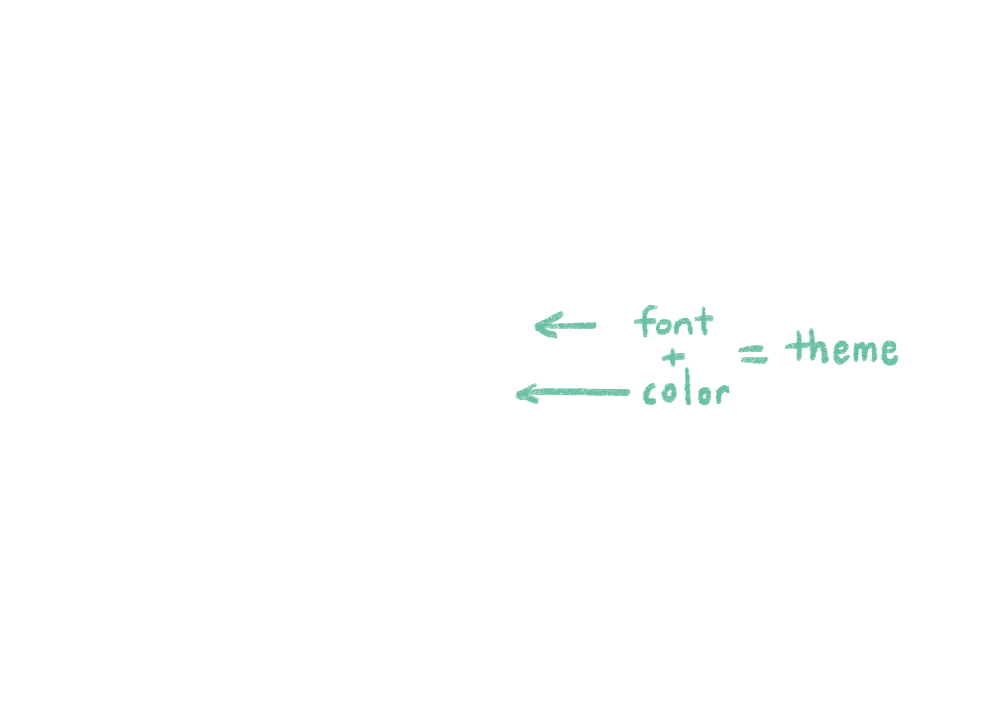

--

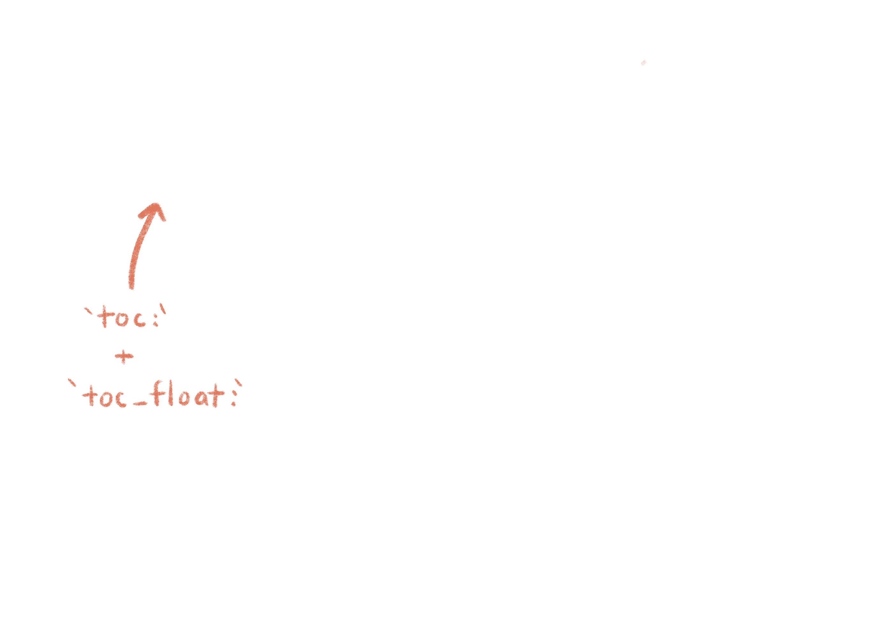

--

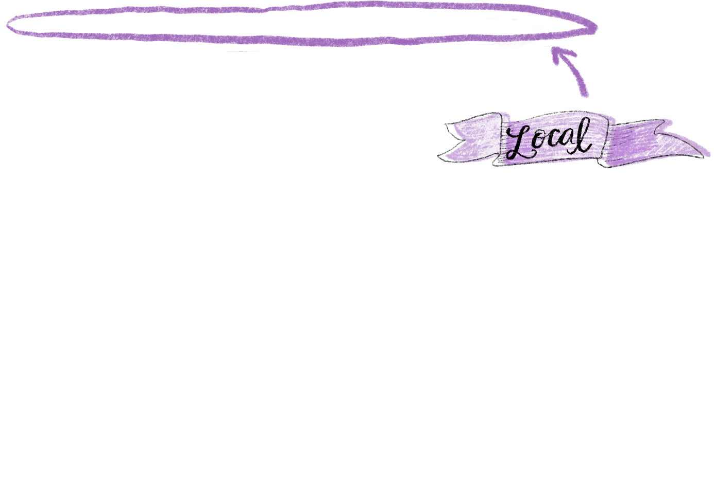

???

Okay, so here's a screenshot of the same rendered file in our browser, and now we can see how some of the keys in our YAML affected our document: 

+ The font and colors that we see are from a theme that we added in the output. 

+ And we also have this nice table of contents that sticks to the left side of the window -- that's also from options that we set in our YAML.

This looks great, and is now in a format that we probably wouldn't mind sharing--BUT--- it's still local and stuck on our computer. This up here is just the file path to where this HTML file lives in my R project.

We need a **link** that we can give our learners. 

---
class: center middle

## What does a .emphasis[linkable] Rmd look like?

--

```{r hello-index, echo=FALSE}
knitr::include_graphics("images/hello-index.jpg")
```

???

So then what does a *linkable* RMD look like? There are two pre-requisites: 

1. You have to make sure we have an R Markdown document is named `index.Rmd` -- an internet browser will always begin by looking for a file named index to open up first. 

---
background-image: url("images/Server.jpg")
background-size: 80%
background-position: bottom
class: center, top

## What does a .emphasis[linkable] Rmd look like?

--


--


???

2. We need a web server, which is basically (as Heather Nolis described it at her conf talk this year)--- [CLICK] a big computer in the clouds.

And for this webinar, we'll use servers provided by Netlify.

(h/t Heather Nolis: https://resources.rstudio.com/rstudio-conf-2020/we-re-hitting-r-a-million-times-a-day-so-we-made-a-talk-about-it-heather-nolis-dr-jacqueline-nolis)

---
class: top center

## What does a .emphasis[linkable] Rmd look like?
.pull-left[
## Go here:
#### [app.netlify.com/drop](https://app.netlify.com/drop)
]

.pull-right[

]

???

So, I'll demo this in a second, but essentially,if you go to this link, you can drag and drop an HTML file, and Netlify will host it online. Let's see what this looks like...


---
class: center, middle

<video width="1200" height="625" controls>
    <source src="images/single-doc-dnd.mp4" type="video/mp4">
</video>
???

So on the lef I have my Lab02 R Project folder, which has the HTML file we knit a bit ago. 

And then in my browser, I'll go to app.netlify.com/drop -- and  drag n drop the folder in. 

A few seconds later, Netlify has  auto-generated a silly-name link and deployed our page -- this link is where our Lab02 page now lives,  and you can share your page with whomever you choose --  hooray!


---
class: center, middle
background-image: url(images/Clouds.jpg)
background-size: cover

# What just happened?

---
background-image: url(images/what-happened/single-doc/Slide1.jpeg)
class: middle center
background-size: contain


???

**We started with an R Markdown file named index**

We knit this to convert to an internet-ready HTML file

It looked great, but still only lived locally in our R Project folder

So then we dragged and dropped our folder

Netlify deployed our page

and generated a link! Ta - da!

---
background-image: url(images/what-happened/single-doc/Slide2.jpeg)
class: middle center
background-size: contain


???

We started with an R Markdown file named index

**We knit this to convert to an internet-ready HTML file**

It looked great, but still only lived locally in our R Project folder

So then we dragged and dropped our folder

Netlify deployed our page

and generated a link! Ta - da!

---
background-image: url(images/what-happened/single-doc/Slide3.jpeg)
class: middle center
background-size: contain


???

We started with an R Markdown file named index

We knit this to convert to an internet-ready HTML file

**It looked great, but still only lived locally in our R Project folder**

So then we dragged and dropped our folder

Netlify deployed our page

and generated a link! Ta - da!

---
background-image: url(images/what-happened/single-doc/Slide4.jpeg)
class: middle center
background-size: contain


???

We started with an R Markdown file named index

We knit this to convert to an internet-ready HTML file

It looked great, but still only lived locally in our R Project folder

**So then we dragged and dropped our folder**

Netlify deployed our page

and generated a link! Ta - da!

---
background-image: url(images/what-happened/single-doc/Slide5.jpeg)
class: middle center
background-size: contain


???

We started with an R Markdown file named index

We knit this to convert to an internet-ready HTML file

It looked great, but still only lived locally in our R Project folder

So then we dragged and dropped our folder

**Netlify deployed our page**

and generated a link! Ta - da!

---
background-image: url(images/what-happened/single-doc/Slide6.jpeg)
class: middle center
background-size: contain


???

We started with an R Markdown file named index

We knit this to convert to an internet-ready HTML file

It looked great, but still only lived locally in our R Project folder

So then we dragged and dropped our folder

Netlify deployed our page

**and generated a link! Ta - da!**


---
class: middle, center

## Sharing = index + knit + drop -> LINK

???

Sharing your R Markdown means three things:

1. Have an index.Rmd

1. Knit to HTML

1. Transfer to web server

???

---
background-image: url(images/rawpixel/single-balloon.jpg)
background-size: contain
background-position: left
class: middle, center

.pull-right[
### But that is just one .Rmd file...
]


---
background-image: url(images/rawpixel/bunch-balloons.jpg)
background-size: contain
background-position: right
class: middle, center

.pull-left[
### We want to share many .Rmd files!
]


---
background-image: url(images/mtsalsa0.jpg)
background-position: bottom center
background-size: contain
class: top, center

## So where are we going?

???

So we're going to hike "markdown mountain"...

---
background-image: url(images/mtsalsa.jpg)
background-position: bottom center
background-size: contain
class: top, center

## So where are we going?

???

And our goal for the rest of this webinar is to show you 4 RMD tools that are for turning a *COLLECTION* of RMDs into a web*site*.


---
name: default_site
class:  top, center
background-image: url(images/mtsalsa-rmd.jpg)
background-size: contain
background-position: center, bottom

# `install.packages("rmarkdown")`

???

So let's begin with an R Markdown site.

---
class: center top
background-color: #f5ede4

<https://apreshill.github.io/data-vis-labs-2018>

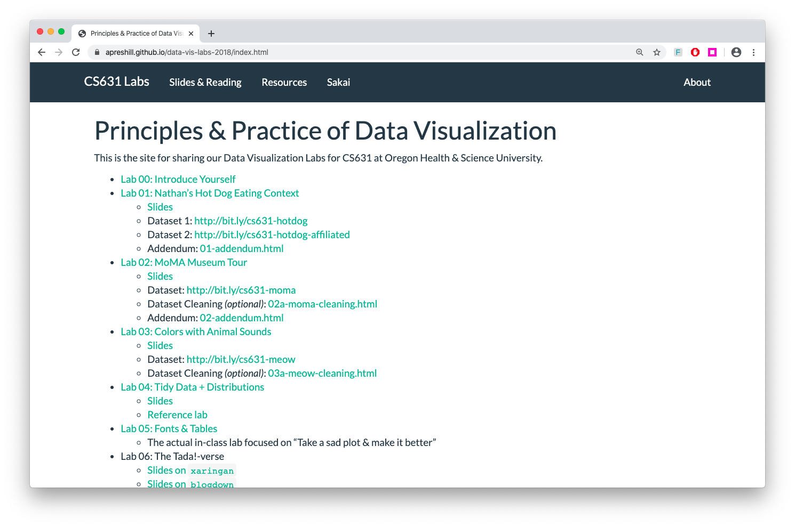

--


???

Here's what one looks like out in the wild. And if you remember our single R Markdown page, this doesn't look that different.

The main difference is that we have a navbar at the top -- with links that will take us to other pages.


---
class: center middle
background-color: #f5ede4

<https://apreshill.github.io/data-vis-labs-2018>


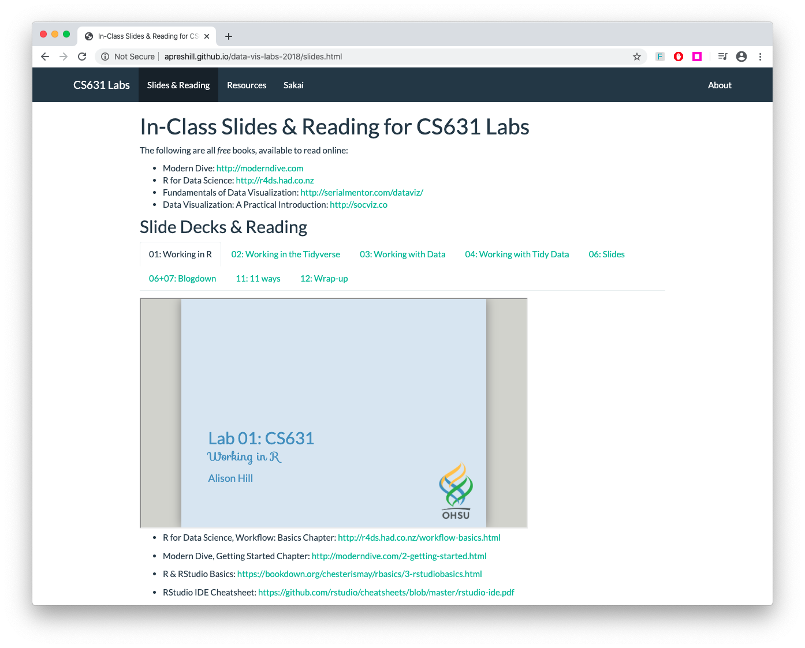

???

Link to other pages, including one's you've made.
    
---
class: center middle
background-color: #f5ede4

<https://apreshill.github.io/data-vis-labs-2018>


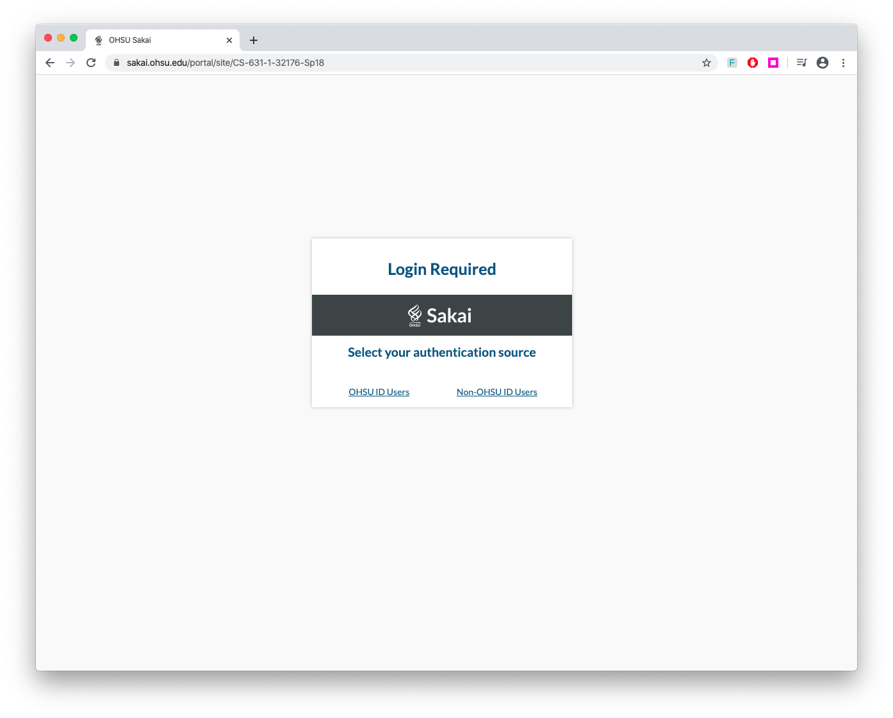


???

But you can also link to external pages here too, like this one here which in this case goes to a learning management system.

---
name: build1

## Build your site

.pull-left[

```{r eval=FALSE}
.
├── rstats101.Rproj
├── _site.yml
├── index.Rmd 
├── schedule.Rmd 
├── lab01.Rmd
└── lab02.Rmd
```
]

.pull-right[
```{r echo=FALSE}
knitr::include_graphics("images/rproj.png")
```

]
???

So let's build a minimal R Markdown site of our own. 

Imagine that this box on the left is the list of files that are inside of our R Project folder. 

Let's take a look inside some of these...

---
name: build2

## Build your site

.pull-left[

```{r eval=FALSE}
.
├── rstats101.Rproj
├── _site.yml
├── index.Rmd #<<
├── schedule.Rmd 
├── lab01.Rmd
└── lab02.Rmd
```
]


.pull-right[
```{r echo=FALSE}
knitr::include_graphics("images/hello-index.jpg")
```
]

???

Just like before when we created a single page, we have an `index.Rmd` file. 

---
name: build3

## Build your site

.pull-left[

```{r eval=FALSE}
.
├── rstats101.Rproj
├── _site.yml
├── index.Rmd 
├── schedule.Rmd #<<
├── lab01.Rmd #<<
└── lab02.Rmd #<<
```
]

.pull-right[
```{r echo=FALSE}
knitr::include_graphics("images/rmd-friends.jpg")
```
]

???

But now there are a few other R Markdown files, too. 


---
name: build4

## Build your site

.pull-left[

```{r eval=FALSE}
.
├── rstats101.Rproj
├── _site.yml #<<
├── index.Rmd 
├── schedule.Rmd 
├── lab01.Rmd 
└── lab02.Rmd 
```
]

.pull-right[
```{r, echo=FALSE}
knitr::include_graphics("images/Q.jpg")
```
]

???

And you might not recognize this file. That's new...

---
name: build5

## Build your site

.left-column[

```{r eval=FALSE}
.
├── rstats101.Rproj
├── _site.yml #<<
├── index.Rmd 
├── schedule.Rmd 
├── lab01.Rmd 
└── lab02.Rmd 
```
]

.right-column[
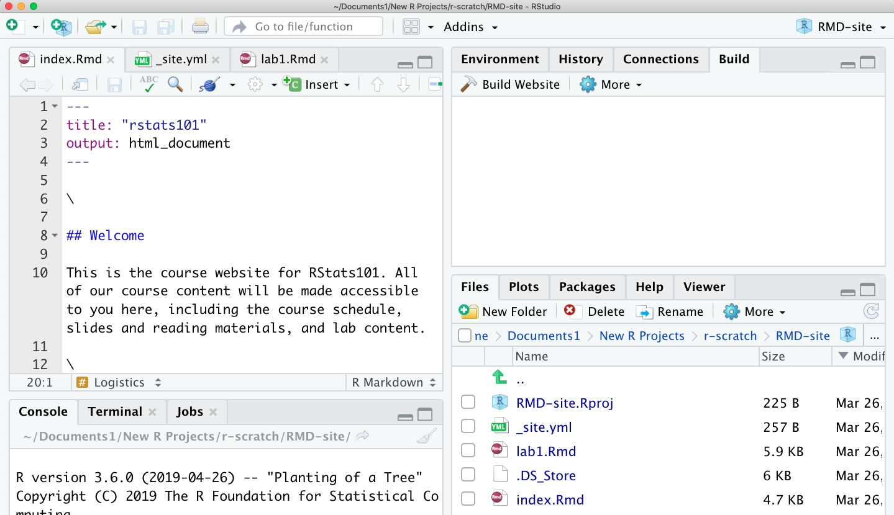
]

???

But before we dig deeper into the files here, let's knit all the pages in our R Markdown site in one fell swoop. 

To do that, you can mouse over to the Build Tab in the IDE and then click "Build Website".

---
name: build6

## Build your site

.left-column[
```{r eval=FALSE}
.
├── rstats101.Rproj
├── _site/ #<<
├── _site.yml
├── index.Rmd 
├── schedule.Rmd 
├── lab01.Rmd 
└── lab02.Rmd 
```
]

.right-column[
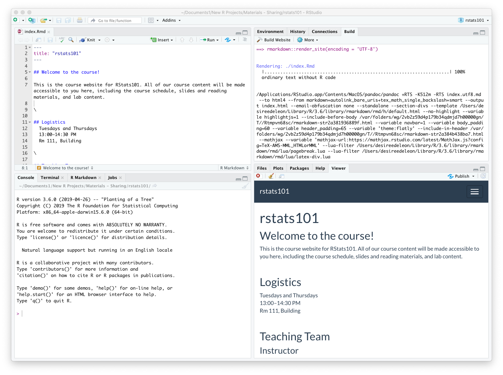
]

(note: RMD site in viewer pane is NOT the default setting)

???

So after we've built our site, we'll see a lot of output in the Build pane, and it's also possible to see a preview of your site in the Viewer pane. 

And now let's look at our directory tree -- there's a new folder that was made. This is the `_site/` folder, and it holds all the HTML files that were just knit. 

Let's see what our site looks like...

---
class: center top
background-color: #f5ede4

## R Markdown site


???

Here is the site we just built. We have a navbar and a theme that will apply to all pages on our site -- and even a dropdown menu!

Let's look under the hood and see some of the site's source code, starting with the index.

---
background-image: url("images/rawpixel/bunch-balloons-rmd1.jpg")
background-position: right
background-size: contain

## Inside the `index.Rmd`

.left-column[

```{r eval=FALSE}
.
├── rstats101.Rproj
├── _site/ 
├── _site.yml
├── index.Rmd #<<
├── schedule.Rmd 
├── lab01.Rmd
└── lab02.Rmd
```
]

???

Remember that the index.Rmd is a special R Markdown documen--- because In any site, whatever file is named `index` will be treated as the homepage.  

So if our site was a big bunch of hot air ballons, `index` would be the main one of them all. 

---
## Inside the `index.Rmd`

.left-column[

```{r eval=FALSE}
.
├── rstats101.Rproj
├── _site/ 
├── _site.yml
├── index.Rmd #<<
├── schedule.Rmd 
├── lab01.Rmd
└── lab02.Rmd
```
]

.right-column[

```
---
title: "rstats 101"
---

Welcome to the course!
```

to-do convert to ymlthis
]

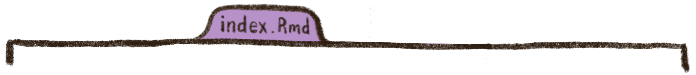

???

If we take a peek inside index, you'll notice that the YAML is much more pared down-- 

 but in fact, it doesn't have to be -- Here we're only using a key for the title, but we could have kept the exact same YAML that we had a single RMD document or we even gotten rid of that and had no YAML at all-- depending on what information we want to show. The meta data we include in each document is flexible in an RMD site. 

(We'll see why next.)

---
background-image: url("images/rawpixel/bunch-balloons-rmd2.jpg")
background-position: right
background-size: contain

## Inside the `_site.yml`

.left-column[
```{r eval=FALSE}
.
├── rstats101.Rproj
├── _site/ 
├── _site.yml #<<
├── index.Rmd 
├── schedule.Rmd 
├── lab01.Rmd
└── lab02.Rmd
```
]

???

Next up, we have `_site.yml`: this is the site's configuration page, and it is basically is a YAML to rule all other RMD YAMLS in our site.

It is because of this file, that our index page (and all other RMDs in our site) can be so-pared down.

In our balloon analogy, `_site.yml` is the basket that is bringing all the ballon strings together.

Let's take a look inside...
---
## Inside the `_site.yml`

.left-column[

```{r eval=FALSE}
.
├── rstats101.Rproj
├── _site/ 
├── _site.yml #<<
├── index.Rmd 
├── schedule.Rmd 
├── lab01.Rmd
└── lab02.Rmd
```
]

.right-column[

```{r echo=FALSE}
yml_empty() %>%
  yml_navbar(
    title = "rstats101",
    left = list(
      navbar_page("Schedule", href = "schedule.html"),
      navbar_page("Labs", 
                  menu = list(
                    navbar_page("Lab 1", href = "lab01.html"),
                    navbar_page("Lab 2", href = "lab02.html")
                    )
                  )
      )) %>% 
  yml_output(html_document(theme = "flatly")) %>% 
  asis_yaml_output(fences = FALSE)
```


]


???

Alright, let's pause a little longer here and walk through this:

* If you've only ever worked with a single R MArkdown file before, then you've maybe never seen `navbar:` as a YAML key. As you might expect, all of the options indented under here are what build our navbar:
    
    + The first line gives a title to our site, and creates the link in the navbar to go to the homepage.
    
    + The next thing is `left:`, and this assigns your navbar links will go on the left side immediately next to the the site title. (but you can also choose `right:`)
    
    + Underneath are nested YAML keys where we spell out what items we want in the navbar. 
    
    + Whenever you make a new R MArkdown document, if you want it to show up in  your navbar, you have to remember to add a reference to it here! (Alison can interject here about forgetting to do this). 
    
    + So say I have an R Markdown document with Syllabus information. I put in the text that I want for its link in the navbar. And then I have to tell _site.yml what the link's destination should be -- that's its `href:` (stands for hypertext reference). 
    
    **note!** the href should always end in `.html`
    
    + finally -- we can use a `menu:` key to build a the dropdown menu you saw in our site earlier. This dropdown menu has two items, each links to a lab page. 


+ And then there's an output section: 
we had this before too. ANy keys we apply here will apply to all other parts of our site -- so *this* is why our index.Rmd's YAML was optional. 

---
## R Markdown site

.left-column[

```{r eval=FALSE}
.
├── rstats101.Rproj
├── _site/ 
├── _site.yml #<<
├── index.Rmd #<<
├── schedule.Rmd 
├── lab01.Rmd
└── lab02.Rmd
```
]

.right-column[
```{r, echo=FALSE}
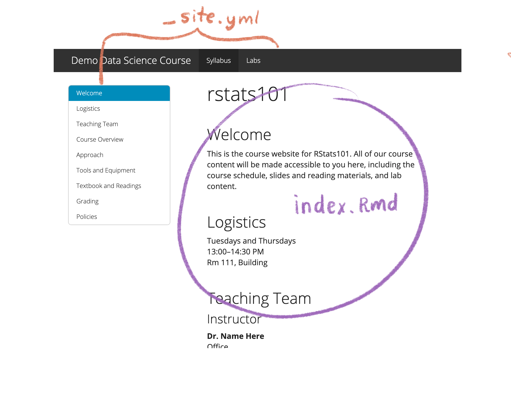
```
]

???

So, for the most minimal R Markdown site, the minimum required files are index and _site.yml.

It is optional, (but likely) that you'll want to add other RMD pages to your collection.

---
background-image: url("images/rawpixel/bunch-balloons-rmd3.jpg")
background-position: right
background-size: contain

## Inside a page

.left-column[

```{r eval=FALSE}
.
├── rstats101.Rproj
├── _site/ 
├── _site.yml 
├── index.Rmd 
├── schedule.Rmd 
├── lab01.Rmd #<<
└── lab02.Rmd
```
]

???
In fact, 

Every Rmd is a page

---

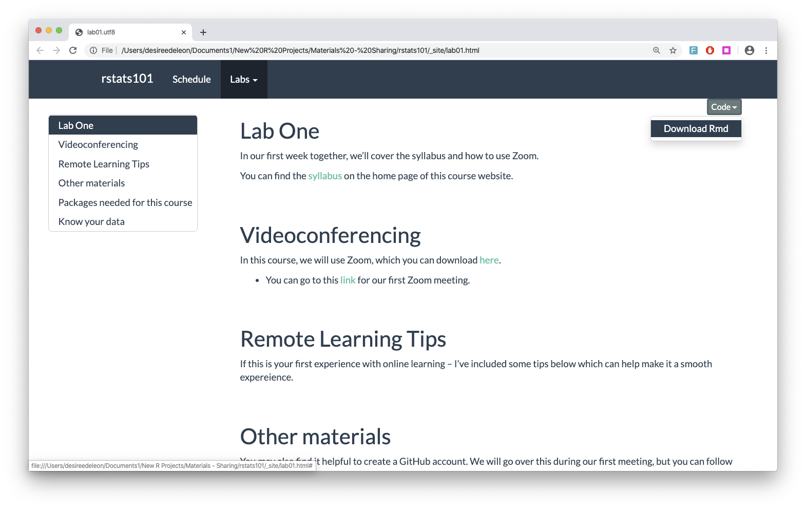

???

quiz Alison, what do you think the YAML for this page looks like??

Answer:

toc
toc_float
and code download (be sure screenshot is taken after clicking on code download button so the drop down shows up like: https://pbs.twimg.com/media/D2OwEBxUYAAG3YN?format=jpg&name=4096x4096)

---
## Inside a page

.left-column[

```{r eval=FALSE}
.
├── rstats101.Rproj
├── _site/ 
├── _site.yml 
├── index.Rmd 
├── schedule.Rmd 
├── lab01.Rmd #<<
└── lab02.Rmd
```
]

.right-column[

```{r echo=FALSE}
 yml_empty() %>%
  yml_output(html_document(toc = TRUE, toc_float = TRUE, code_download = TRUE)) %>% 
  asis_yaml_output()
```

```
# Lab One

In our first week together, 
we'll cover the syllabus 
and how to use Zoom.

```

]

that's exactly what we see -- 

---

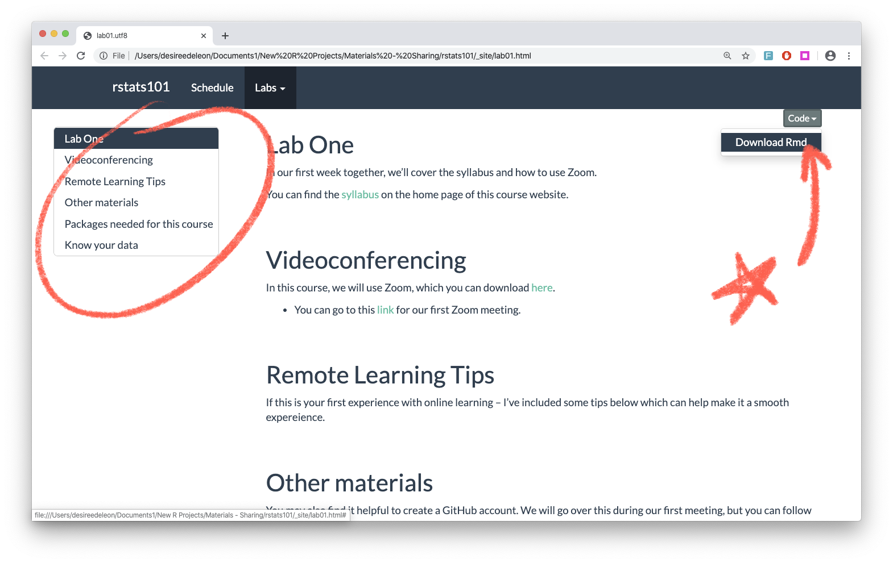

???

circle toc, note floating

circle code download button

---
background-image: url("images/rawpixel/bunch-balloons-rmd4.jpg")
background-position: right
background-size: contain

## Sharing your site

.left-column[

```{r eval=FALSE}
.
├── rstats101.Rproj
├── _site/ #<<
├── _site.yml 
├── index.Rmd 
├── schedule.Rmd 
├── lab01.Rmd 
└── lab02.Rmd
```
]

???

Okay, we're finally, ready to share our R MArkdown site -- we'll do this the same way as before. All of our HTML, website-ready pages are stored in the _site/ folder. So This this is the only folder, we need to ddrag and drop 

---
class: center, middle

<video width="1316" height="630" controls>
    <source src="images/rmd-site-dnd.mp4" type="video/mp4">
</video>

???

And we will drop that folder back into netlify to make our site. 

---
class: center, middle

# But...

.left-column[

]

.right-column[

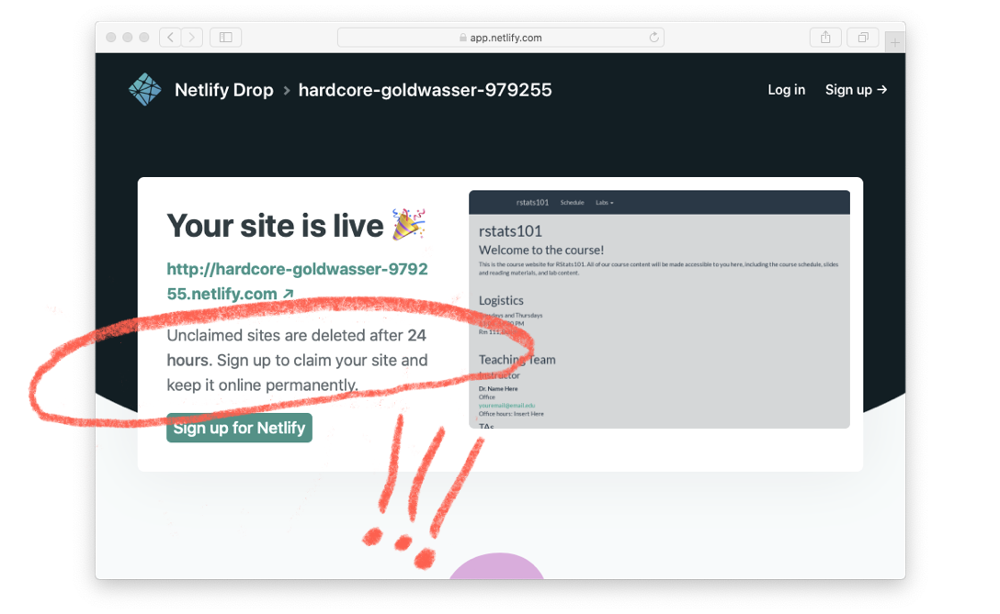

Only exists for 24 hours. 

]

???

But if we do nothing else, this site will only exist for 24 hours. We need to make a Netlify account to make it stick. 

---
class: center, middle

# Back to Netlify

Make an account.

---
class: middle center

<video width="1510" height="638" controls>
    <source src="images/netlify-account.mp4" type="video/mp4">
</video>

???

So let's go back to Netlify and do that. 

If you already use GitHub or GitBucket, then I recommend you use that to sign in becuase you're workflow will be smoother if your accounts are connected. But for today, I'm just going to sign up with email...

Once you've signed up, you'll see you have an account dashboard. And your silly-named link is now here to stay. 


---
template: clouds

# What if I make a change?

---

## What if I make a change?

.pull-left[
```{r echo=FALSE}
yml_empty() %>%
  yml_output(html_document(theme = "united")) %>% #<<
  asis_yaml_output(fences = FALSE)
```
]


--

.pull-right[

 * Change theme to `united`
 
 * Build again
 
]

???

Imagine that after we've dragged and drop, we decide we want to change our site theme -- let's try 

---

class: center, middle

<video width="1560" height="620" controls>
    <source src="images/netlify-update.mp4" type="video/mp4">
</video>

???

Once we've re-built our site wiith the changes we want. We'll go back to our _site/ folder. 

In netlify, we can make sure we are in the "deploy" tab of our dashboard -- and there's a spot specifically for updating. WE can drag and drop again here. 

We click on the link--and see our new theme has been applied.

---
template: clouds

# Thoughts on R Markdown Sites

???

You now know how to build and update an R Markdown site. There are a few additional considerations I want to point out. 

---
template: clouds2
class: middle center

## No Subfolders

<https://github.com/apreshill/data-vis-labs-2018>

```{r stay-organized, echo=FALSE}
knitr::include_graphics("https://dcossyleon.github.io/gifs/video/stay-organized1.gif")
```

???

The first is that RMD sites will not automatically Build RMD files that are contained in subfolders. This means that all RMDS have to be in the project root directory. 

If you have a lot of files you want to link to in your course, keeping your project tidy can start to feel tricky. That's why this repository of an RMD site that i'm showing you here looks so full. 

One solution you can use in this scenario is to have good file-naming hygiene: consistently use number pre-fixing to keep your files in order.

---
class: middle
background-image: url(images/rawpixel/blue-balloon-side.jpg)
background-position: left
background-size: contain

.pull-right[
### R Markdown Site

* Source stays same

* Built-in themes

* Simple -> short notice

]

---
class: middle
background-image: url(images/rawpixel/balloon-ouch.jpg)
background-position: right
background-size: contain

.pull-left[
### R Markdown site

* No subfolders

* Manual update

]

???

So in summary for RMD site, 
You don't have to change much from your original docs. 
You get to use built in themes from bootstrap
..
..
..

---
name: distill
class:  top, center
background-image: url(images/mtsalsa-distill.jpg)
background-size: contain
background-position: center, bottom

# `install.packages("distill")`

???

Next up is Distill, which you'll need to install first before you can use it. 

---
class: middle, center
template: clouds2
background-image: cover

<https://rstudio.github.io/distill/>


???

Here you get to see a bit of what a Distill site looks like, and actually the site I'm showing you is the documentation site for Distill itself. 

The design that you see is the out-of-the-box styling that you get. It's not easy to change or customize this, but it looks pretty sleek, so this doens't matter too much.

Distill is basically an R MArkdown site's sibling but with more technical and scientific interests. 

It has almost the exact same structure, but it comes with some built-in features that make it easier to author math and science content.

For example...

---
template: clouds2
class: middle, center

<https://rstudio.github.io/distill/>
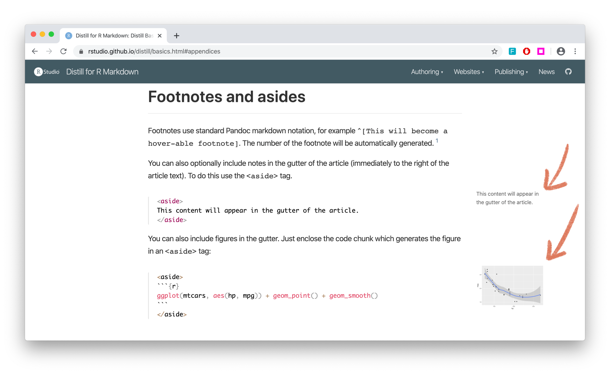

???

`<aside> my margin note </aside>`

---
class: middle, center
template: clouds2

<https://rstudio.github.io/distill/>
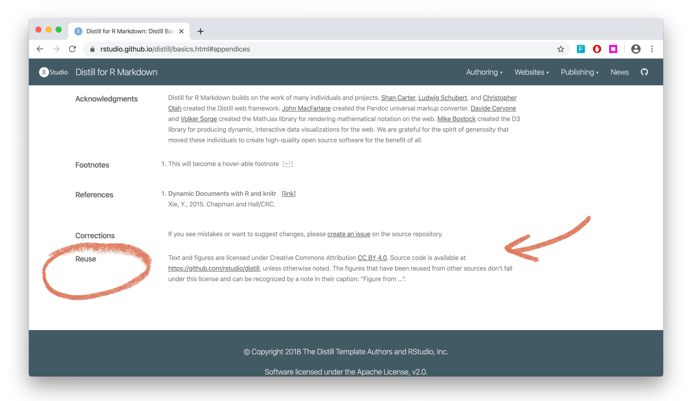

---
template: clouds2

## Build your site

.left-column[

```{r eval=FALSE}
.
├── DataViz101.Rproj
├── _site/ #<<
├── _site.yml 
├── index.Rmd 
├── Project1.Rmd 
└── Project2.Rmd 
```
]

.right-column[
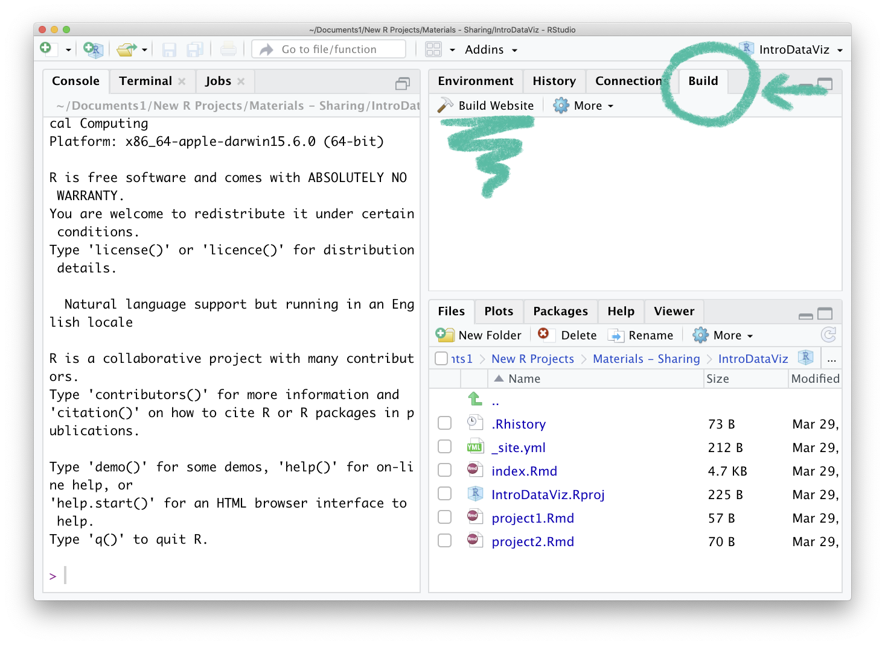
]


???

So let's build a minimal Distill site of our own. 

Same as RMD site -- Build tab.

Also, this will put our HTML files in a _site folder.

---

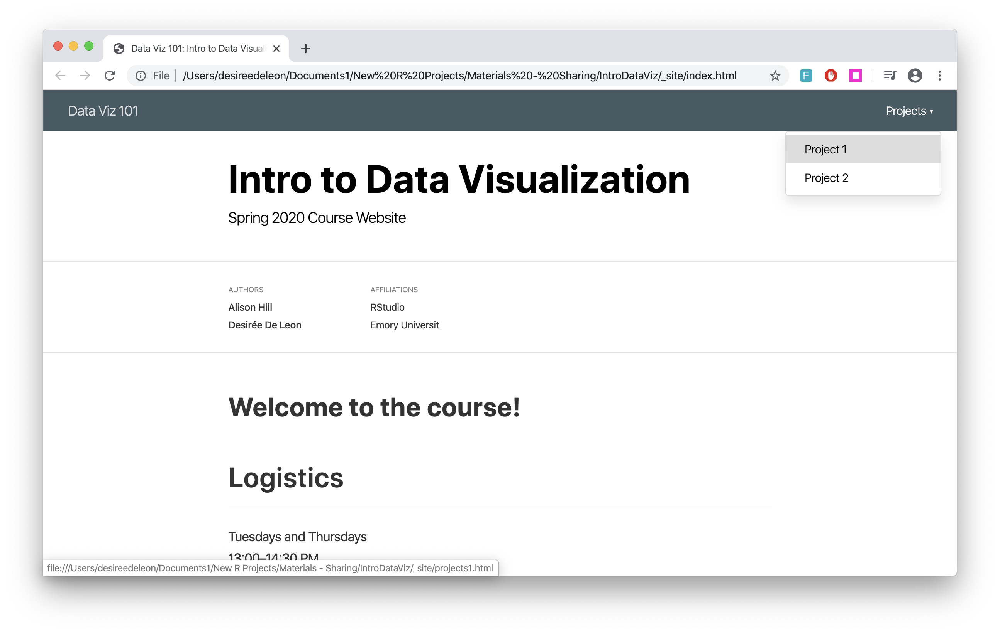
--

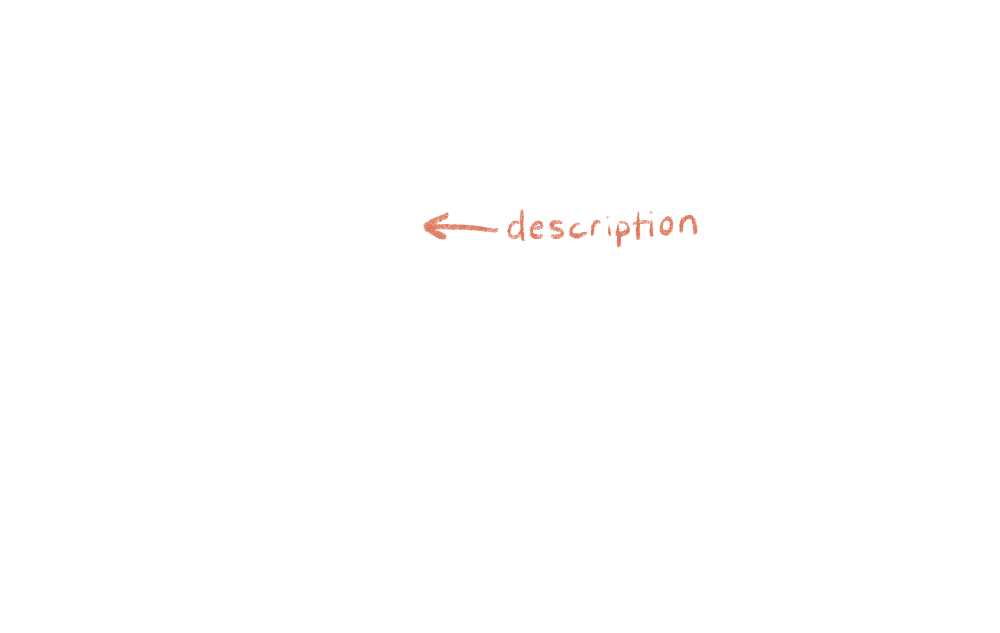

--
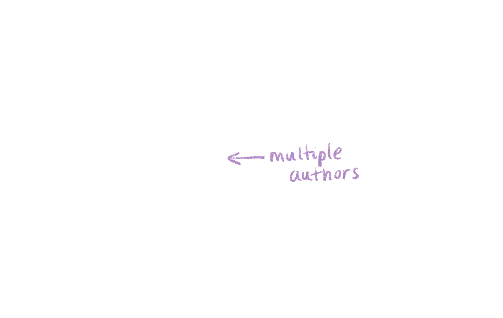

--

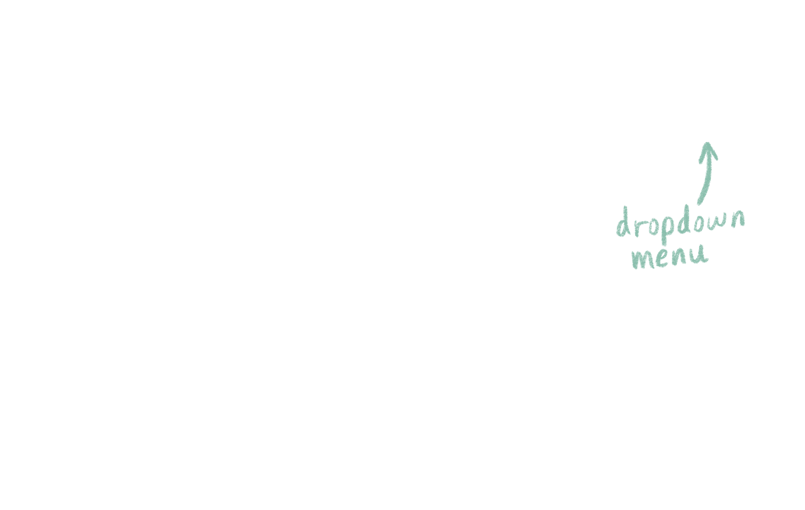


???

Quick things to notice -- let's look inside.

---
background-image: url("images/rawpixel/bunch-balloons-rmd1.jpg")
background-position: right
background-size: contain

## Inside the `index.Rmd`

.left-column[
```{r eval=FALSE}
.
├── DataViz101.Rproj
├── _site/
├── _site.yml 
├── index.Rmd #<<
├── Project1.Rmd 
└── Project2.Rmd 
```
]

???

The index page in a distill site will function the same way that it did in the RMD page. It will be the site's home page.

---
template: clouds2

## Inside the `index.Rmd`

.left-column[
```{r eval=FALSE}
.
├── DataViz101.Rproj
├── _site/
├── _site.yml 
├── index.Rmd #<<
├── Project1.Rmd 
└── Project2.Rmd 
```
]

.right-column[
```
---
title: Intro to Data Visualization
description: Spring 2020 Course Website
author:
  - name: Alison Hill
    affiliation: RStudio
  - name: Desirée De Leon
    affiliation: Emory University
---

# Welcome to the course!
```
]


???

At a minimum, I recommend having a `title:`, but including a short description or tagline is nice too. 

It's also possible to add multiple authors to any Distill page, which could be useful if you're co-teaching (or if you decide to have students form groups to author their own Distill articles)

---
background-image: url(images/rawpixel/bunch-balloons-rmd2.jpg)
background-position: right
background-size: contain

# Inside the `_site.yml`

.left-column[
```{r eval=FALSE}
.
├── DataViz101.Rproj
├── _site/
├── _site.yml #<<
├── index.Rmd
├── Project1.Rmd 
└── Project2.Rmd 
```

]

???

Next we move on to the _site.yml page. Site configuration. This should sound a bit familiar...

---
template: clouds2

# Inside the `_site.yml`

.left-column[
```{r eval=FALSE}
.
├── DataViz101.Rproj
├── _site/
├── _site.yml #<<
├── index.Rmd
├── Project1.Rmd 
└── Project2.Rmd 
```

]

.right-column[
```
title: Data Viz 101
navbar:
  right:
    - text: Projects
      menu: 
      - text: Project 1
        href: projects1.html
      - text: Project 2
        href: projects2.html
output: distill::distill_article
```
]


???

The YAML keys here are all very similar, with one important change.

The output MUST specify that this is a Distill article. This is how the site knows to apply the Distill styling and framework. 

Other than this, you can take any of your existing RMD documents, clean out its individual frontmatter YAML at the top, and plop it into your Distill navbar key to implement it as a Distill article. 

---
class: center middle
exclude: true


---
background-image: url(images/Whisper.jpg)
background-size: contain

<div class="word-bubble" style="
  position: absolute; 
  text-align: center;
  width: 50%; 
  top: 100px;
  left: 310px;
  font-size: 1.3em;
"> Alas, I have kept one important thing <br> from you about Distill websites. </div>


---
class: center middle

#  A Distill Blog

---


???

A page on your site that compiles a chronological listing of R Markdown posts. 

For a course, let's say that after every class, you'd like to post notes or announcements about that day's lesson. With a blog, you can do that easily -- 

The most recently updated R MArkdown doc will pop to the top. This creates a student-centered approach to designing website content -- because students will always be able to tell what has been recently updated. This is not always the case with non-blog style pages.
---

## Make a blog post

.left-column[
```{r eval=FALSE}
.
├── DataViz101.Rproj
├── _site/
├── _site.yml
├── index.Rmd
├── Project1.Rmd 
└── Project2.Rmd 
```
]

.right-column[
```{r, eval= FALSE}

distill::create_post("Week 1")

```

What did this add?

]


---
background-image: /*url("images/rawpixel/bunch-balloons-rmd4.jpg")*/
background-position: right
background-size: contain

## `_posts/`

.pull-left[
```{r eval=FALSE}
.
├── DataViz101.Rproj
├── _site/
├── _site.yml
├── index.Rmd
├── Project1.Rmd 
├── Project2.Rmd
└── _posts/ #<<
```
]

???

A new folder for blog posts --- inside you have a subdirectory and RMD file for your new post. 

---

# Inside a post

.left-column[
```{r eval=FALSE}
.
└── _posts/ 
  └── Week1 # Optional
    └── Week1.Rmd #<<
    
```
]

.right-column[
```
---
title: Week 1
date: 03-24-2020
output:
  distill::distill_article:
    self_contained: false
---

During our first week we will make our first plots with `ggplot2`.
```

* Posts **MUST** be knit individually
* Rinse and repeat for each new post.

]
---

## Add a listing page

.left-column[
```{r eval=FALSE}
.
├── DataViz101.Rproj
├── _site/
├── _site.yml
├── index.Rmd
├── Project1.Rmd 
├── Project2.Rmd 
└── listings.Rmd #<<

```

]

.right-column[
```
---
listing: posts
---
```
]

???

But we need a way to tell our Distill site that this post exists. We create a listing page -- a content-less page whose only job is to compile all the posts we've authored and knit. 

We create a listings page in our root directory. The RMD file can be called anything -- the only critical piece is that it have this listing key in its YAML.

---
## Update the `_site.yml`

.left-column[
```{r eval=FALSE}
.
├── DataViz101.Rproj
├── _site/
├── _site.yml #<<
├── index.Rmd
├── Project1.Rmd 
├── Project2.Rmd 
└── listings.Rmd
```

]

.right-column[
```
title: Data Viz 101
navbar:
  right:
    - text: Schedule
      href: listings.html
    - text: Projects
      menu: 
      - text: Project 1
        href: projects1.html
      - text: Project 2
        href: projects2.html
    - text: Schedule
      href: listings.html
output: distill::distill_article
```
]

---
class: middle, center

blog page = listing page + `distill::create_post()`

---

GIF drag and drop _site/ to netlify

---

change domain name

---

.pull-right[

### Distill Sites

* Sleek

* 2 content flavors

* Nice features out-of-the-box

]

---

.pull-left[

### Distill Sites

* Knit posts one-by-one (but no manual adding to menus!)

* Project organization


]

---
name: bookdown
class:  top, center
background-image: url(images/mtsalsa-book.jpg)
background-size: contain
background-position: center, bottom


# `install.packages("bookdown")`


???


---
background-image: url("images/rawpixel/writing-machine.jpg")
background-size: contain
background-position: right
class: middle

# Online book with...

--

+ Table of contents

--

+ Chapters

--

+ Bells & whistles


---
class: middle, center

<https://bookdown.org/yihui/bookdown/>

<iframe src="https://bookdown.org/yihui/bookdown/" height="600" width="1200" frameborder="0"></iframe> 

???

Some new features to point out during "tour" :
* A very long TOC
* Chapters 
* Sections

---
## Build your book

.left-column[

```{r eval=FALSE}
.
├── book.Rproj
├── _bookdown.yml
├── _output.yml
├── index.Rmd 
├── week01.Rmd
├── week02.Rmd
├── week03.Rmd
└── _book #<<
```
]

.right-column[
Build your book with the Build tab. 
]

---
background-image: url("images/rawpixel/bunch-balloons-book1.jpg")
background-position: right
background-size: contain

## Inside the `index.Rmd`

.left-column[

```{r eval=FALSE}
.
├── book.Rproj
├── _bookdown.yml
├── _output.yml
├── index.Rmd #<<
├── week01.Rmd
├── week02.Rmd
├── week03.Rmd
└── _book
```
]

???

The index.Rmd file is special. It is both the first chapter, and contains some YAML for the book's metadata like the title. You can think of this as the mega-YAML for your book- it is the YAML for all the chapters.

---
## Inside the `index.Rmd`

.left-column[

```{r eval=FALSE}
.
├── book.Rproj
├── _bookdown.yml
├── _output.yml
├── index.Rmd #<<
├── week01.Rmd
├── week02.Rmd
├── week03.Rmd
└── _book
```
]

.right-column[

```{r echo=FALSE, comment='#'}
# x <- as_yml("knit: bookdown::render_book")
yml_empty() %>%
  yml_title("rstats101 book") %>%
  yml_author("Alison Hill") %>%
  yml_bookdown_site() %>% 
  # yml_toplevel(x) %>% 
  asis_yaml_output()
cat("Welcome {-}")
```

]

---
background-image: url("images/rawpixel/bunch-balloons-book2.jpg")
background-position: right
background-size: contain

## Inside the `.yml`s

.left-column[
```{r eval=FALSE}
.
├── book.Rproj
├── _bookdown.yml #<<
├── _output.yml #<<
├── index.Rmd 
├── week01.Rmd 
├── week02.Rmd 
├── week03.Rmd 
└── _book 
```
]

---

## Inside the `_bookdown.yml`

.left-column[
```{r eval=FALSE}
.
├── book.Rproj
├── _bookdown.yml #<<
├── _output.yml 
├── index.Rmd 
├── 01-week.Rmd 
├── 02-week.Rmd 
├── 03-week.Rmd 
└── _book 
```
]

.right-column[
```{r echo=FALSE}
yml_empty() %>%
  yml_bookdown_opts(new_session = TRUE) %>% 
  asis_yaml_output(fences = FALSE)
```
]

???

new session forces bookdown to do what is called knit then merge

strongly recommend

K-M uses separate R sessions for individual chapters

each chapter compiles from a clean state, including packages loaded

Without it, you would need to make sure that you don't have any duplicate chunk labels throughout your ENTIRE book.

BUT K-M does not allow Rmd files to be in subdirectories,

---

## Inside the `_bookdown.yml`

.left-column[
```{r eval=FALSE}
.
├── book.Rproj
├── _bookdown.yml #<<
├── _output.yml 
├── index.Rmd 
├── week01.Rmd 
├── week02.Rmd 
├── week03.Rmd 
└── _book 
```
]

.right-column[
```{r echo=FALSE}
yml_empty() %>%
  yml_bookdown_opts(
    new_session = TRUE,
    rmd_files = c("index.Rmd", "week01.Rmd", "week02.Rmd", "week03.Rmd")
    ) %>% 
  asis_yaml_output(fences = FALSE)
```
]

---

## Inside the `_output.yml`

.left-column[
```{r eval=FALSE}
.
├── book.Rproj
├── _bookdown.yml 
├── _output.yml #<<
├── index.Rmd 
├── 01-week.Rmd 
├── 02-week.Rmd 
├── 03-week.Rmd 
└── _book 
```
]

.right-column[

```yaml
bookdown::gitbook: default
```

]

---
background-image: url("images/rawpixel/bunch-balloons-book3.jpg")
background-position: right
background-size: contain

## Inside the chapters

.left-column[

```{r eval=FALSE}
.
├── book.Rproj
├── _bookdown.yml
├── _output.yml
├── index.Rmd 
├── week01.Rmd #<<
├── week02.Rmd #<<
├── week03.Rmd #<<
└── _book
```
]

???

Every Rmd is a chapter

---
## Inside one chapter

.left-column[

```{r eval=FALSE}
.
├── book.Rproj
├── _bookdown.yml
├── _output.yml
├── index.Rmd 
├── week01.Rmd #<<
├── week02.Rmd 
├── week03.Rmd 
└── _book
```
]

.right-column[

```
# Week One

In our first week together, 
we'll cover the syllabus 
and how to use Zoom.

```

]

???

Main points- the Rmd chapters don't have any YAML. This will mean that you'll need to change any individual Rmd that you want to make into chapters.


---
background-image: url("images/rawpixel/bunch-balloons-book4.jpg")
background-position: right
background-size: contain

## Sharing your book

.left-column[

```{r eval=FALSE}
.
├── book.Rproj
├── _bookdown.yml
├── _output.yml
├── index.Rmd 
├── week01.Rmd
├── week02.Rmd
├── week03.Rmd
└── _book #<<
```
]

---

drag and drop goes here


---


???

For example... a directory that looks like this.

Your RMDs will be in the root. The first one is still index.Rmd. This becomes the first page of your book. Usually an preface or Intro.

The REst of the RMDs are numbered. These each become book chapters. 

---
# Do I need to change the RMDs?

Yes. 

* You (might) need to rename all the files to have a numerical order. 
* All chapter .Rmd files MUST begin with a `# Level 1 Header` no matter what. No front matter YAMLS.

---

# ...here's why

(maybe if time allows)


---

# Pros and Cons of Bookdown

.pull-left[

* Hard to get lost
* Order
* Cross-references
* Numbered figures, equations, tables

]

.pull-right[

* Three YAMLS (time consuming to set up)
* No subfolders


]

---
name: blogdown
class: top, center
background-image: url(images/mtsalsa-blogdown.jpg)
background-size: contain
background-position: center, bottom


# `install.packages("blogdown")`


???


---
background-image: url(images/rawpixel/knight.jpg)
background-size: contain
background-color: #F5ECE0

---
class: center, middle, inverse

```{r echo=FALSE}
knitr::include_graphics("images/hugo.svg")
```

<https://gohugo.io/>


---
class: center, middle
background-image: url(images/Clouds2.jpg)
background-size: cover

<https://academic-demo.netlify.com/>

<iframe src="https://academic-demo.netlify.com/" height="600" width="1200" frameborder="0"></iframe> 

---
class: center, middle
background-image: url(images/Clouds2.jpg)
background-size: cover

<https://share-blogdown.netlify.com/>

<iframe src="https://share-blogdown.netlify.com/" height="600" width="1200" frameborder="0"></iframe> 

---
background-image: url(images/rawpixel/balloon-ouch.jpg)
background-position: left
background-size: contain
class: middle

.pull-right[

## `blogdown` advice

]

.pull-right[

+ Don't update Hugo during your course.

]

--

.pull-right[

+ Don't update your Hugo theme during your course.

]
--

.pull-right[

+ Seriously, just don't update anything during your course.

]

---

Can't get anywhere else

+ Subdirectories

+ Ability to "knit" all output formats (like R Markdown slides, plain Rmd documents, etc.) with single button

+ Ability to "serve" all outputs on a single site

---

# Here's a shortcut you can use

Deploy to netlify link

???

Gif

---
class: inverse, center, middle

# Review

Need four square view with static screenshots of each of the 4 sites

???

Say out loud which folder to drag and drop for each (maybe have the text show up in each of the four squares like `site/`, `_book/`, `public/`)

---
class: inverse, center, middle

# Advice

+ build, don't knit (generally)

+ know your site's output directory!

+ publish early and update often, don't wait

---

# the options

???

which options work best for whom?

---

# Other links, resources, stuff

Looking ahead:

Connect netlify to github and use continuous deployment for your sites

Link out to gh repo for all the things? I can make issues with resources for each tool

---
background-image: url("images/rawpixel/site-dreams.jpg")
background-size: 80%
background-position: bottom, center
class: center, top
background-color: #FCFEF8

# Thank you

???

Thanks for joining us today. We hope we've left you with some ideas you can use now and later. And we hope we leave you with visions of websites dancing in your heads :)

---
name: excuses

## 3 excuses

.columns[

.left-col[
"I can't give away my work!"


] 


.middle-col[
"It's not perfect (yet)!" 

*"If it knits, it ships."*
]


.right-col[
"It's scary." 

*"If it hurts, do it more often."*
]

]
